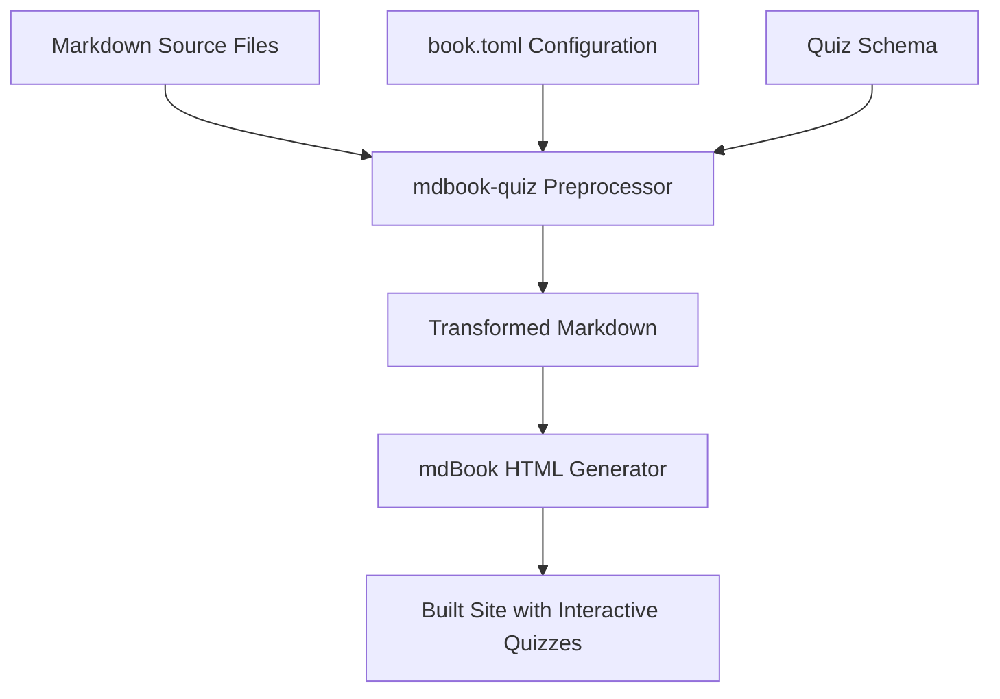

# Design: Interactive Course Quizzes for Linux Mastery Course

## Overview

This design describes adding interactive, multiple-choice quiz questions to all 13 chapters of the mdBook-based Linux mastery course. The quizzes will be implemented using the `mdbook-quiz` preprocessor, with **all quiz questions placed at the end of each chapter** in a dedicated quiz section. Each question will include explanations for answers and allow multiple attempts.

**Goal:** Make the course more interactive and engaging while reinforcing learning through playful, challenging questions.

---

## Detailed Requirements

### Functional Requirements

1. **Quiz Plugin Integration**
   - Install and configure `mdbook-quiz` preprocessor
   - Enable validation to allow answer checking and multiple attempts
   - Ensure quizzes render properly in the built mdBook site

2. **Question Placement**
   - All quiz questions placed at the END of each chapter
   - In a dedicated "## Chapter Quiz" section
   - Before the existing "Exercises" section
   - Does not interrupt the reading flow

3. **Question Design**
   - All questions must be multiple choice format
   - Difficulty level: "playful challenging" — not too easy, not frustrating
   - Questions must be contextually relevant to preceding content
   - Each question must include answer explanations

4. **Scope**
   - Cover all 13 chapters:
     - Part I: Foundations (Chapters 1-3)
     - Part II: CLI Mastery (Chapters 4-7)
     - Part III: System Administration (Chapters 8-11)
     - Part IV: DevOps Introduction (Chapters 12-13)

5. **User Interaction**
   - Show explanation after answering
   - Allow multiple attempts
   - Provide immediate feedback on correct/incorrect

### Non-Functional Requirements

1. **Accessibility**
   - Quizzes must be screen reader compatible
   - Keyboard navigation support
   - Clear visual feedback

2. **Performance**
   - Quizzes should not significantly increase page load time
   - Quiz JavaScript should load asynchronously

3. **Maintainability**
   - Quiz questions should be easy to update
   - Format should be consistent across all chapters

---

## Architecture Overview



### Flow

1. Author writes quiz questions in Markdown using `mdbook-quiz` syntax
2. `mdbook-quiz` preprocessor processes Markdown files
3. Preprocessor replaces quiz directives with interactive HTML
4. mdBook builds the site with embedded quiz functionality
5. Users interact with quizzes in their browser

---

## Components and Interfaces

### 1. Quiz Question Component

Each quiz question follows this structure:

```
{{#quiz}}
What is the Linux kernel?

A) The complete operating system
B) The core component managing hardware resources
C) A desktop environment
D) A package manager

{{#explain}}
The Linux kernel is the core component that manages hardware resources
and enables software to communicate with the CPU, memory, and devices.
{{/explain}}
{{/quiz}}
```

### 2. Configuration Interface

**File:** `book.toml`

```toml
[preprocessor.quiz]
validate = true  # Enable validation for multiple attempts
```

### 3. Question Types (Supported by mdbook-quiz)

| Type | Syntax | Use in Course |
|------|--------|---------------|
| Multiple Choice | `{{#quiz}}` with options A,B,C,D | Primary format |
| Short Answer | `{{#quiz}}` with open field | Optional use |

### 4. Chapter Quiz Section Structure

Each chapter will have a dedicated quiz section at the end:

```markdown
## Chapter Quiz

Test your knowledge with these challenging questions!

{{#quiz}}
Question 1...

{{#quiz}}
Question 2...

---

## Exercises
```

---

## Data Models

### Quiz Question Schema

```yaml
quiz:
  type: multiple-choice
  question: string
  options:
    - label: string (A, B, C, D...)
      text: string
      correct: boolean
  explanation: string
  context: string  # Reference to preceding section
```

### File Structure

```
src/
├── part-1-foundations/
│   ├── chapter-01-philosophy.md       # With quizzes inserted
│   ├── chapter-02-installation.md     # With quizzes inserted
│   └── chapter-03-gnome.md            # With quizzes inserted
├── part-2-cli/
│   ├── chapter-04-filesystem.md       # With quizzes inserted
│   └── ... (all chapters)
├── part-3-sysadmin/
│   └── ... (all chapters)
└── part-4-devops/
    └── ... (all chapters)
```

---

## Error Handling

### Preprocessor Errors

| Error Type | Handling |
|------------|----------|
| Invalid quiz syntax | Preprocessor fails build with error message |
| Missing options | Warning in build output |
| Duplicate correct answers | Validation error |

### Runtime Errors

| Error Type | Handling |
|------------|----------|
| JavaScript not loaded | Graceful degradation, show plain text |
| Invalid state | Reset question to initial state |

---

## Acceptance Criteria

### AC1: Plugin Installation
**Given** a fresh mdBook project
**When** I run `cargo install mdbook-quiz`
**Then** the plugin installs successfully
**And** I can verify installation with `mdbook-quiz --version`

### AC2: Configuration
**Given** the project's `book.toml` file
**When** I add the quiz preprocessor configuration
**Then** mdBook recognizes the preprocessor
**And** building the book includes quiz processing

### AC3: Quiz Rendering
**Given** a chapter with embedded quiz questions
**When** I build and view the book
**Then** quiz questions appear as interactive elements
**And** I can select an answer
**And** clicking submit shows feedback

### AC4: Multiple Attempts
**Given** an answered quiz question
**When** I select a different answer
**Then** I can submit again
**And** receive updated feedback

### AC5: Explanation Display
**Given** a quiz question
**When** I submit an answer
**Then** the explanation is displayed
**And** indicates which answer is correct

### AC6: All Chapters Covered
**Given** the 13 chapter files
**When** I scan all files for quiz content
**Then** every chapter contains a dedicated "## Chapter Quiz" section
**And** each quiz has 5-10 challenging questions
**And** the quiz section appears before the "Exercises" section

### AC7: Accessibility
**Given** a rendered quiz question
**When** I navigate with keyboard
**Then** all options are focusable
**And** screen reader announces question and options

### AC8: Mobile Responsive
**Given** a quiz question on mobile viewport
**When** I view the page
**Then** quiz elements are properly sized
**And** buttons are tappable

---

## Testing Strategy

### Unit Tests
- Quiz syntax validation
- Correct answer detection
- Explanation rendering

### Integration Tests
- Build process completes with quizzes
- Quizzes render in output HTML
- JavaScript loads and functions

### Manual Testing
- Answer each question type
- Verify explanations appear
- Test multiple attempts
- Check keyboard navigation
- Test on mobile devices

### User Acceptance Testing
- Course author reviews questions for accuracy
- Sample users test for engagement
- Feedback on difficulty level

---

## Appendices

### Appendix A: Technology Choices

| Technology | Justification |
|------------|---------------|
| **mdbook-quiz** | Purpose-built for mdBook, supports validation, actively maintained |
| **Multiple Choice** | Familiar format, easy to validate, works well on mobile |
| **Native Validation** | No custom JavaScript needed, better accessibility |

### Appendix B: Research Findings Summary

**Key Sources:**
- [mdbook-quiz GitHub](https://github.com/cognitive-engineering-lab/mdbook-quiz)
- [Quiz design best practices (Articulate)](https://www.articulate.com/blog/8-strategies-for-a-winning-technical-training-program/)
- [Multiple choice question design (UWaterloo)](https://uwaterloo.ca/centre-for-teaching-excellence/catalogs/tip-sheets/designing-multiple-choice-questions)

**Key Insights:**
- Use plain language, avoid jargon
- Focus on learning experience, not just assessment
- Quality over quantity (fewer, better questions)
- Include plausible distractors

### Appendix C: Alternative Approaches Considered

| Approach | Pros | Cons | Decision |
|----------|------|------|----------|
| HTML `<details>` tags | Simple, no dependencies | No validation, basic UX | Rejected |
| mdbook-exercises | Good for coding | Overkill for simple quizzes | Rejected |
| Custom JavaScript | Full control | Maintenance burden, accessibility concerns | Rejected |
| mdbook-quiz | Built for this purpose, validates answers | Requires plugin setup | **Selected** |

### Appendix D: Example Quiz Questions

**Example 1 (Chapter 1 - Philosophy):**
```
{{#quiz}}
Which freedom from the Free Software Movement allows you to study how the program works and change it?

A) Freedom 0
B) Freedom 1
C) Freedom 2
D) Freedom 3

{{#explain}}
Freedom 1 is the freedom to study how the program works, and change it.
This requires access to source code.
{{/explain}}
{{/quiz}}
```

**Example 2 (Chapter 5 - CLI Basics):**
```
{{#quiz}}
Which command would you use to view the first 20 lines of a large file?

A) cat -n 20 file.txt
B) head -n 20 file.txt
C) less +20 file.txt
D) tail -n 20 file.txt

{{#explain}}
`head -n 20 file.txt` displays the first 20 lines.
`cat` shows the entire file, `less` opens a pager, and `tail` shows the END of the file.
{{/explain}}
{{/quiz}}
```

### Appendix E: Implementation Notes

**Quiz Section Structure:**
- Each chapter ends with a dedicated `## Chapter Quiz` section
- Quiz appears before the existing `## Exercises` section
- 5-10 questions per chapter (varies by chapter complexity)

**Question Writing Guidelines:**
- Cover all major topics from the chapter
- Use "playful challenging" tone with some humor
- At least 4 options per question
- Include one clearly wrong option (for fun)
- Include two plausible distractors
- Explanation should teach, not just state the answer

**Chapter Structure (Before):**
```markdown
## Summary

## Exercises

## Expected Output
```

**Chapter Structure (After):**
```markdown
## Summary

## Chapter Quiz

{{#quiz}}
...

## Exercises

## Expected Output
```
