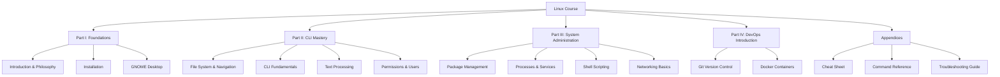
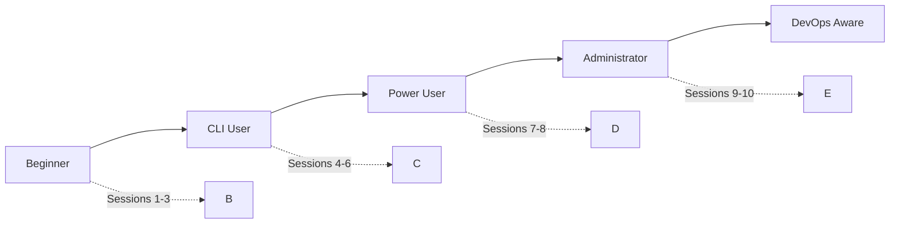

# Linux Course Design Document

## Overview

This document outlines the design for a comprehensive Linux course targeting university students with no prior Linux experience. The course spans 10 sessions of 1.5 hours each (15 hours total) and is delivered as an mdBook — a Markdown-based book format suitable for online publishing and distribution.

### Course Vision

Transform complete beginners into confident Linux users who:
- Use Linux comfortably as their daily driver operating system
- Master the Command Line Interface (CLI) for efficient system control
- Understand and appreciate open-source philosophy
- Perform basic system administration tasks
- Use essential development tools (Git, Docker) at an introductory level

### Target Audience

| Attribute | Description |
|-----------|-------------|
| **Background** | University students, complete beginners to Linux |
| **Programming** | Familiar with basic programming concepts |
| **Current OS** | Windows users, no CLI experience |
| **Class Size** | ~15 students |
| **Motivation** | Personal use, development, system administration |

---

## Detailed Requirements

### Functional Requirements

#### FR1: Course Structure
- The course must be organized into **topic-based chapters** that map to 10-12 sessions
- Each session must include **learning objectives**, **prerequisites**, **content**, **examples**, and **exercises**
- The course must cover installation, CLI mastery, and basic DevOps tools

#### FR2: Distribution Support
- Content must apply to **both Fedora and Debian** distributions
- Package management commands must be provided for **both DNF and APT**
- Desktop environment focus: **GNOME**

#### FR3: Installation Coverage
- Must cover **dual-boot installation** (preferred)
- Must cover **Virtual Machine setup** as alternative
- Must include partitioning basics

#### FR4: CLI Mastery
- Students must master navigation, file operations, permissions
- Focus on **20 core commands** rather than exhaustive lists
- Include **pipes, redirection, and wildcards**

#### FR5: Development Tools
- Must include **introductory Git** (10 essential commands)
- Must include **introductory Docker** (6 basic commands)

#### FR6: Capstone Project
- Students must complete a **Personal Linux Server** project
- Must demonstrate: web server setup, automation, version control

### Non-Functional Requirements

#### NFR1: Engagement
- Include **"wow moment" showcase** of Linux capabilities
- Emphasize customization, development power, and privacy
- Use **real-world examples** throughout

#### NFR2: Accessibility
- Code blocks must use **syntax highlighting**
- Include **visual elements**: diagrams, screenshots, terminal outputs
- Content must be clear and easy to understand

#### NFR3: Assessment
- Include **quiz-based assessment**
- Provide **optional homework with bonus points**
- Include **exercises with expected output** for each session

#### NFR4: Format
- Deliver as **mdBook** format
- Include **cheat sheet** section at end
- Support both **light and dark themes**

---

## Architecture Overview

### Course Architecture



### Learning Progression



---

## Components and Interfaces

### mdBook Structure

```
linux-course/
├── book.toml                    # Configuration
├── book/
│   ├── SUMMARY.md               # Table of contents
│   ├── intro.md                 # Introduction
│   │
│   ├── part-1-foundations/
│   │   ├── chapter-01-philosophy.md
│   │   ├── chapter-02-installation.md
│   │   └── chapter-03-gnome.md
│   │
│   ├── part-2-cli/
│   │   ├── chapter-04-filesystem.md
│   │   ├── chapter-05-cli-basics.md
│   │   ├── chapter-06-text-processing.md
│   │   └── chapter-07-permissions.md
│   │
│   ├── part-3-sysadmin/
│   │   ├── chapter-08-packages.md
│   │   ├── chapter-09-processes.md
│   │   ├── chapter-10-scripting.md
│   │   └── chapter-11-networking.md
│   │
│   ├── part-4-devops/
│   │   ├── chapter-12-git.md
│   │   └── chapter-13-docker.md
│   │
│   ├── capstone.md              # Final project
│   │
│   └── appendices/
│       ├── cheat-sheet.md
│       ├── command-reference.md
│       └── troubleshooting.md
│
├── images/                      # Screenshots, diagrams
│   ├── session01/
│   ├── session02/
│   └── ...
│
└── exercises/                   # Exercise files
    ├── session01/
    ├── session02/
    └── ...
```

### Chapter Template

Each chapter follows this structure:

```markdown
# Chapter N: Title

## Learning Objectives
- [ ] Objective 1
- [ ] Objective 2
- [ ] Objective 3

## Prerequisites
- Required prior knowledge
- Any setup steps

## Content
Main teaching content...

## Examples
### Before
```bash
# Problem state
```

### After
```bash
# Solution state
```

## Summary
Brief recap of key points...

## Exercises
1. Exercise description
2. Exercise description

## Expected Output
```bash
# What students should see
```
```

---

## Data Models

### Command Reference Format

Each command is documented with:

| Field | Description |
|-------|-------------|
| `command` | The command syntax |
| `description` | What it does |
| `common_flags` | Frequently used options |
| `example` | Practical example |
| `dnf_equivalent` | DNF equivalent (if APT) |
| `apt_equivalent` | APT equivalent (if DNF) |

### Exercise Format

```yaml
exercise:
  id: EX-01
  title: "Exercise Title"
  difficulty: beginner | intermediate | advanced
  time_estimate: "10 minutes"
  objectives:
    - "Do X"
    - "Verify Y"
  steps:
    - "Step 1: ..."
    - "Step 2: ..."
  expected_output: |
    [OUTPUT]
  hints:
    - "Hint 1"
    - "Hint 2"
  bonus: "Optional challenge"
```

---

## Error Handling

### Common Error Patterns Addressed

| Error | Cause | Solution |
|-------|-------|----------|
| `command not found` | Typos, package not installed | Spell check, install package |
| `permission denied` | Missing sudo | Use sudo or fix permissions |
| `no such file` | Wrong path | Check pwd, use tab completion |
| `operation not permitted` | Restricted action | Check file permissions |
| `repository not found` | Wrong repo URL | Check sources.list |

### Troubleshooting Strategy

Each session includes:
1. **Common errors** specific to the topic
2. **Debug commands** (e.g., `strace`, `journalctl`, `dmesg`)
3. **Where to get help** (man pages, --help, forums)

---

## Acceptance Criteria

### Given-When-Then Format

#### AC1: Installation Success
**GIVEN** a university student with a Windows laptop
**WHEN** they follow the installation chapter
**THEN** they can:
- Create a bootable USB
- Install Linux in dual-boot configuration
- Boot into their new Linux system

#### AC2: CLI Navigation
**GIVEN** a student who completed sessions 1-5
**WHEN** presented with a terminal
**THEN** they can:
- Navigate any directory structure
- Create, copy, move, and delete files
- Use tab completion efficiently
- Read and understand command output

#### AC3: Package Management
**GIVEN** a student on either Fedora or Debian
**WHEN** they need to install software
**THEN** they can:
- Search for packages using the appropriate command
- Install software with dependencies
- Update their system
- Remove unwanted packages

#### AC4: Permissions and Users
**GIVEN** a student who completed the permissions chapter
**WHEN** they encounter permission issues
**THEN** they can:
- Understand `ls -l` output
- Use `chmod` and `chown` correctly
- Distinguish when to use `sudo`
- Create and manage user accounts

#### AC5: Shell Scripting
**GIVEN** a student who completed the scripting chapter
**WHEN** they need to automate a task
**THEN** they can:
- Write a basic bash script
- Use variables and arguments
- Implement loops and conditionals
- Make the script executable

#### AC6: Git Proficiency
**GIVEN** a student who completed the Git chapter
**WHEN** working on a project
**THEN** they can:
- Initialize a repository
- Stage and commit changes
- View commit history
- Create and switch branches

#### AC7: Docker Basics
**GIVEN** a student who completed the Docker chapter
**WHEN** they need to run a containerized application
**THEN** they can:
- Pull an image from a registry
- Run a container
- List running containers
- Stop and remove containers

#### AC8: Capstone Completion
**GIVEN** a student who completed all sessions
**WHEN** they attempt the capstone project
**THEN** they can:
- Set up a web server (Apache/nginx)
- Create and serve a custom HTML page
- Write an automated backup script
- Track their work with Git
- Present their working system

---

## Testing Strategy

### Content Verification

1. **Command Accuracy**
   - All commands tested on both Fedora and Debian
   - Screenshots reflect current versions
   - Output examples are verbatim

2. **Exercise Validation**
   - Each exercise has been tested
   - Expected output is reproducible
   - Time estimates are realistic

3. **Cross-Distro Compatibility**
   - Package commands provided for both DNF and APT
   - Distro-specific notes clearly marked
   - Alternatives provided where features differ

### Student Assessment

| Assessment Type | Purpose | Timing |
|----------------|---------|--------|
| **In-session exercises** | Hands-on practice | Every session |
| **Quiz questions** | Knowledge check | End of each session |
| **Homework** | Reinforcement | Optional, bonus points |
| **Capstone project** | Integration demonstration | Session 10 |

### Quality Metrics

- **Clarity**: Students can follow without instructor assistance
- **Accuracy**: All commands work as documented
- **Completeness**: Topics cover stated objectives
- **Engagement**: Students report increased interest in Linux

---

## Session Mapping

### Topic-to-Session Mapping

| Session | Topic(s) | Theory/Practice Split |
|---------|----------|----------------------|
| 1 | Philosophy, Installation Overview | 60/30 |
| 2 | Installation Lab, First Boot | 20/70 |
| 3 | GNOME Desktop, Customization | 30/60 |
| 4 | File System, Navigation | 30/60 |
| 5 | CLI Fundamentals, Commands | 20/70 |
| 6 | Permissions, Users | 40/50 |
| 7 | Package Management | 30/60 |
| 8 | Processes, Shell Scripting | 30/60 |
| 9 | Git, Docker Intro | 30/60 |
| 10 | Capstone Project, Quiz | 15/75 |

### Core Commands by Session

| Session | New Commands Introduced | Cumulative |
|---------|------------------------|------------|
| 1 | - | 0 |
| 2 | `reboot`, `shutdown` | 2 |
| 3 | GUI navigation | 2 |
| 4 | `pwd`, `ls`, `cd`, `mkdir`, `rmdir`, `touch`, `rm` | 8 |
| 5 | `cat`, `less`, `cp`, `mv`, `find`, `grep`, `|`, `>`, `>>` | 17 |
| 6 | `chmod`, `chown`, `sudo`, `useradd`, `usermod`, `passwd` | 22 |
| 7 | `dnf`/`apt`, `search`, `install`, `remove`, `update` | 27 |
| 8 | `ps`, `top`, `kill`, `systemctl`, `journalctl`, `crontab` | 33 |
| 9 | Git commands (10), Docker commands (6) | 49 |
| 10 | Capstone integration | All |

---

## Appendices

### Appendix A: Technology Choices

| Technology | Rationale |
|------------|-----------|
| **mdBook** | Lightweight, Git-friendly, supports syntax highlighting and themes |
| **Fedora & Debian** | Represent two major distro families; well-documented |
| **GNOME** | Default for both distros; modern, customizable |
| **Git** | Industry standard; reinforces CLI skills |
| **Docker** | Modern dev workflow; demonstrates Linux's dev power |
| **Mermaid** | Built-in diagram support in mdBook |

### Appendix B: Research Findings Summary

**Key Insights from Research:**

1. **Beginner Pain Points:**
   - Terminal intimidation → Mitigated by starting with GUI
   - Command overload → Focus on 20 core commands
   - Fear of breaking system → Use VMs initially
   - Package manager confusion → Explicit equivalence tables

2. **Engagement Factors:**
   - Customization (themes, extensions)
   - Development power (package managers, tools)
   - Privacy/open-source philosophy
   - Terminal efficiency ("wow" demonstrations)

3. **Learning Progression:**
   - GUI first, then CLI
   - Concepts before commands
   - Real-world applications
   - Immediate hands-on practice

### Appendix C: Alternative Approaches Considered

| Decision | Alternative | Why Rejected |
|----------|-------------|--------------|
| Fedora + Debian | Ubuntu only | Less transferable knowledge |
| GNOME only | KDE or multiple | GNOME is default for both distros |
| Topic-based | Strictly session-based | Topic-based allows better flow |
| mdBook | PDF, LaTeX, Docusaurus | mdBook is Git-native, lightweight |
| 20 core commands | Comprehensive reference | Overwhelming for beginners |
| Personal Server capstone | LAMP stack only | Too narrow; doesn't show all skills |

### Appendix D: Dependencies and Prerequisites

**For Students:**
- Windows laptop with admin rights
- 8GB+ USB drive
- Internet connection
- Ability to install VirtualBox (VM option)

**For Instructors:**
- Projector with HDMI/USB-C
- Demo machine with Linux installed
- Whiteboard for diagrams

**For mdBook Generation:**
- `mdbook` package
- `mdbook-toc` preprocessor (optional)
- `mdbook-mermaid` preprocessor (optional)

### Appendix E: Future Enhancements

Potential additions for future versions:
- Advanced shell scripting
- SELinux/AppArmor basics
- Network configuration in depth
- Container orchestration (Podman/Docker Compose)
- Security hardening
- Kernel basics
- Desktop environment alternatives (KDE, tiling WMs)
