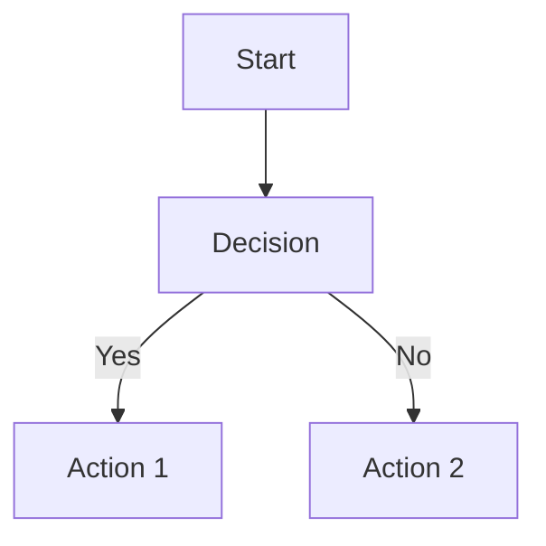

# Research 3: mdBook Best Practices

## Sources Analyzed
- mdBook official documentation
- GitBook and Markdown best practices
- Technical documentation structure guides
- Community examples and themes

## Key Findings

### mdBook Structure

```
my-book/
├── book.toml          # Configuration file
├── book/              # Source directory (default)
│   ├── SUMMARY.md     # Table of contents (required)
│   ├── chapter-1.md
│   ├── chapter-2.md
│   └── ...
├── src/               # Alternate source directory
├── theme/             # Custom theme overrides
└── dist/              # Build output (generated)
```

### SUMMARY.md Format

The table of contents is defined in SUMMARY.md:

```markdown
# Summary

[Introduction](./intro.md)

---

- [Chapter 1: Getting Started](./chapter-1.md)
- [Chapter 2: Basic Commands](./chapter-2.md)
  - [2.1 Navigation](./chapter-2/navigation.md)
  - [2.2 File Operations](./chapter-2/operations.md)
- [Chapter 3: Advanced Topics](./chapter-3.md)

---

- [Appendix: Cheat Sheet](./cheat-sheet.md)
```

**Key patterns:**
- Use `---` to create separator lines
- Nest chapters with 2-space indentation
- Prefix numbers can aid navigation
- Appendices go after final separator

### book.toml Configuration

```toml
[book]
title = "Linux for Everyone"
authors = ["Course Name"]
description = "A comprehensive Linux course"
language = "en"
multilingual = false
src = "book"

[build]
build-dir = "dist"
create-missing = true

[preprocessor.toc]
command = "mdbook-toc"
renderer = ["html"]

[output.html]
default-theme = "light"
preferred-dark-theme = "ayu"
curly-quotes = true
mathjax-support = true
copy-fonts = true
```

### Code Block Syntax Highlighting

mdBook supports syntax highlighting via highlight.js:

````markdown
```bash
#!/bin/bash
echo "Hello, Linux!"
```
````

Supported languages relevant to this course:
- `bash` — Shell commands and scripts
- `sh` — POSIX shell
- `yaml` — Config files
- `markdown` — Markdown examples
- `diff` — Showing file changes
- `text` — No highlighting (terminal output)

### Educational Content Structure

**Recommended chapter template:**

```markdown
# Chapter Title

## Learning Objectives
- [ ] Objective 1
- [ ] Objective 2

## Prerequisites
- Previous chapter content
- Any required setup

## Content
Main teaching content here...

## Examples

### Before
```bash
# Show the problem
```

### After
```bash
# Show the solution
```

## Summary
Brief recap...

## Exercises
1. Exercise 1
2. Exercise 2

## Expected Output
```bash
# What students should see
```
```

### Visual Elements in mdBook

**Mermaid diagrams** (requires preprocessor):
```markdown

```

**Images:**
```markdown


```

**ASCII Art:**
```
File System Structure
/
├── home/
│   └── user/
├── etc/
│   └── systemd/
└── var/
    └── log/
```

### Accessibility Best Practices

1. **Descriptive link text** — Not "click here"
2. **Alt text for images** — Especially screenshots
3. **Code annotations** — Explain what code does
4. **Keyboard navigation** — Built into mdBook
5. **Print-friendly** — mdBook generates good PDFs

### Theme Considerations

**For a course:**
- Use light theme by default (better for projectors)
- Enable dark theme option (student preference)
- Consider `ayu` for code readability
- Custom CSS for exercise boxes, warnings, tips

### Organization Patterns

**For topic-based organization:**
```
Part I: Foundations (Sessions 1-3)
Part II: CLI Mastery (Sessions 4-6)
Part III: System Administration (Sessions 7-8)
Part IV: Development & DevOps (Sessions 9-10)
```

**Each session in mdBook:**
- Standalone chapter
- Links to related content
- Exercise at end
- Reference back to earlier topics

## Recommendations

1. **Use `src/` directory** for source files (convention)
2. **Create a chapter template** — Reuse structure
3. **Preorganize SUMMARY.md** — Even if files don't exist yet
4. **Add TOC preprocessor** — Auto-generate tables of contents
5. **Use `bash` highlighting** for all terminal examples
6. **Separate `images/` directory** — Per chapter
7. **Exercise files in `exercises/`** — Student downloads

## Sources

- mdBook Format Guide: https://rust-lang.github.io/mdBook/format/index.html
- GitBook Best Practices: https://gitbook.com/docs/guides/docs-best-practices/documentation-structure-tips
- Markdown Guide: https://medium.com/beacamp-pub/mastering-markdown-a-simple-guide-for-technical-writers-acccaff9dc8a
