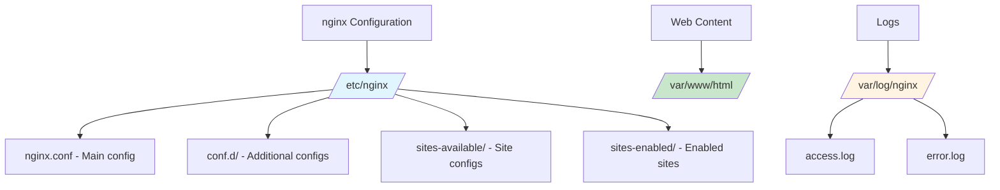

# Capstone: Personal Linux Server

## Overview

This capstone project brings together everything you've learned in this course. You will set up a personal Linux server that demonstrates your newfound skills in system administration, automation, and development tools.

## Project Goals

By completing this capstone, you will:

- Set up and configure a web server (nginx)
- Create and serve a custom webpage
- Write an automated backup script with cron
- Track your configuration with Git
- (Optional) Run services in Docker containers
- Document your entire setup

## Prerequisites

- Completion of all 13 chapters
- Linux system installed and configured
- Root/sudo access
- Basic text editor skills (nano or vim)

---

## Part 1: Web Server Setup

### Task 1.1: Install nginx

Install and configure nginx as your web server:

**Fedora:**
```bash
sudo dnf install nginx
sudo systemctl enable --now nginx
sudo firewall-cmd --permanent --add-service=http
sudo firewall-cmd --permanent --add-service=https
sudo firewall-cmd --reload
```

**Debian:**
```bash
sudo apt update
sudo apt install nginx
# nginx starts automatically on Debian
```

### Task 1.2: Verify Installation

Check that nginx is running:

```bash
# Check service status
sudo systemctl status nginx

# Check if port 80 is listening
sudo ss -tlnp | grep :80

# Test locally
curl http://localhost
```

Open your browser and navigate to: `http://localhost`

You should see the default nginx welcome page.

### Task 1.3: Understand the nginx Directory Structure



---

## Part 2: Custom Webpage

### Task 2.1: Create Your Custom Page

Replace the default nginx page with your own:

```bash
# Backup the original
sudo cp /var/www/html/index.html /var/www/html/index.html.backup

# Create your custom page
sudo nano /var/www/html/index.html
```

Paste this content:

```html
<!DOCTYPE html>
<html lang="en">
<head>
    <meta charset="UTF-8">
    <meta name="viewport" content="width=device-width, initial-scale=1.0">
    <title>My Linux Server</title>
    <style>
        body {
            font-family: 'Segoe UI', Tahoma, Geneva, Verdana, sans-serif;
            max-width: 800px;
            margin: 50px auto;
            padding: 20px;
            background: linear-gradient(135deg, #667eea 0%, #764ba2 100%);
            color: white;
        }
        .container {
            background: rgba(0,0,0,0.3);
            padding: 30px;
            border-radius: 10px;
        }
        h1 { color: #fff; }
        .info { background: rgba(255,255,255,0.1); padding: 15px; margin: 10px 0; border-radius: 5px; }
        .footer { margin-top: 30px; font-size: 0.9em; opacity: 0.8; }
    </style>
</head>
<body>
    <div class="container">
        <h1>Welcome to My Linux Server!</h1>
        <p>This server is proudly running on Linux.</p>

        <div class="info">
            <h3>System Information</h3>
            <ul>
                <li>Operating System: Linux</li>
                <li>Web Server: nginx</li>
                <li>Course: Linux for Everyone</li>
                <li>Status: <strong style="color: #4ade80;">Online</strong></li>
            </ul>
        </div>

        <div class="info">
            <h3>Skills Demonstrated</h3>
            <ul>
                <li>System Administration</li>
                <li>Web Server Configuration</li>
                <li>File Permissions</li>
                <li>Service Management</li>
            </ul>
        </div>

        <div class="footer">
            <p>Powered by Linux | Configured by [Your Name]</p>
        </div>
    </div>
</body>
</html>
```

### Task 2.2: Verify Custom Page

Refresh your browser at `http://localhost`. You should now see your custom page.

---

## Part 3: Automated Backup Script

### Task 3.1: Create Backup Directory

```bash
mkdir -p ~/backups
```

### Task 3.2: Write the Backup Script

Create a comprehensive backup script:

```bash
nano ~/backup-script.sh
```

Add the following content:

```bash
#!/bin/bash

#==============================================
# Linux Server Backup Script
# Course: Linux for Everyone - Capstone Project
#==============================================

# Configuration
BACKUP_DIR="$HOME/backups"
WEB_DIR="/var/www/html"
NGINX_CONF="/etc/nginx"
DATE=$(date +"%Y%m%d_%H%M%S")
BACKUP_NAME="server_backup_$DATE"
LOG_FILE="$BACKUP_DIR/backup.log"

# Create backup directory if it doesn't exist
mkdir -p "$BACKUP_DIR"

# Log function
log() {
    echo "[$(date '+%Y-%m-%d %H:%M:%S')] $1" | tee -a "$LOG_FILE"
}

# Start backup
log "========== Starting Backup: $BACKUP_NAME =========="

# Create backup archive
log "Creating backup archive..."
tar -czf "$BACKUP_DIR/$BACKUP_NAME.tar.gz" \
    -C / \
    "$WEB_DIR" \
    "$NGINX_CONF" \
    2>/dev/null

if [ $? -eq 0 ]; then
    log "Backup created successfully: $BACKUP_NAME.tar.gz"

    # Get file size
    SIZE=$(du -h "$BACKUP_DIR/$BACKUP_NAME.tar.gz" | cut -f1)
    log "Backup size: $SIZE"
else
    log "ERROR: Backup creation failed!"
    exit 1
fi

# Remove backups older than 30 days
log "Cleaning old backups (older than 30 days)..."
find "$BACKUP_DIR" -name "server_backup_*.tar.gz" -mtime +30 -delete
REMOVED=$(find "$BACKUP_DIR" -name "server_backup_*.tar.gz" | wc -l)
log "Backups remaining: $REMOVED"

# Display disk usage
log "Current disk usage of backup directory:"
du -sh "$BACKUP_DIR" | tail -1 | tee -a "$LOG_FILE"

log "========== Backup Complete =========="
echo ""

# List recent backups
echo "Recent backups:"
ls -lht "$BACKUP_DIR"/server_backup_*.tar.gz 2>/dev/null | head -5
```

### Task 3.3: Make Script Executable and Test

```bash
# Make executable
chmod +x ~/backup-script.sh

# Run manually to test
~/backup-script.sh

# Verify the backup was created
ls -lh ~/backups/
```

### Task 3.4: Schedule with Cron

Automate the backup to run daily:

```bash
# Edit crontab
crontab -e

# Add this line to run daily at 2 AM
0 2 * * * /home/$(whoami)/backup-script.sh
```

Verify your crontab:

```bash
crontab -l
```

---

## Part 4: Git Version Control

### Task 4.1: Initialize Git Repository

Track your server configuration with Git:

```bash
# Create project directory
mkdir -p ~/server-project
cd ~/server-project

# Initialize Git repository
git init

# Create project structure
mkdir -p config docs scripts

# Copy configuration files (readable copies)
cp /etc/nginx/nginx.conf config/ 2>/dev/null || sudo cat /etc/nginx/nginx.conf > config/nginx.conf
sudo cat /var/www/html/index.html > config/index.html

# Copy your backup script
cp ~/backup-script.sh scripts/

# Create README
cat > README.md << 'EOF'
# Personal Linux Server

## Overview
This is my capstone project for the Linux for Everyone course.

## System Specifications
- OS: Linux (Fedora/Debian)
- Web Server: nginx
- Automation: cron + bash script
- Version Control: Git

## Setup Instructions

### 1. Install nginx
**Fedora:**
```bash
sudo dnf install nginx
sudo systemctl enable --now nginx
```

**Debian:**
```bash
sudo apt install nginx
```

### 2. Deploy Web Content
```bash
sudo cp config/index.html /var/www/html/index.html
sudo cp config/nginx.conf /etc/nginx/nginx.conf
sudo systemctl reload nginx
```

### 3. Setup Backups
```bash
chmod +x scripts/backup-script.sh
sudo cp scripts/backup-script.sh /usr/local/bin/
crontab -e  # Add: 0 2 * * * /usr/local/bin/backup-script.sh
```

## Maintenance

- Check logs: `sudo journalctl -u nginx -f`
- View backups: `ls -lh ~/backups/`
- Test web server: `curl http://localhost`

## Author
[Your Name] - Linux for Everyone Course
EOF
```

### Task 4.2: Make Initial Commit

```bash
# Add all files
git add .

# Make initial commit
git commit -m "Initial commit: Server configuration and backup script"

# Verify
git log --oneline
```

---

## Part 5: (Optional) Docker Challenge

If you want to showcase your Docker skills, run the web server in a container:

### Task 5.1: Stop nginx Service

```bash
sudo systemctl stop nginx
sudo systemctl disable nginx
```

### Task 5.2: Run nginx in Docker

```bash
# Create data directory
mkdir -p ~/docker-nginx/html

# Copy your custom page
cp ~/server-project/config/index.html ~/docker-nginx/html/

# Run nginx container
docker run -d \
  --name my-nginx \
  -p 80:80 \
  -v ~/docker-nginx/html:/usr/share/nginx/html:ro \
  nginx:alpine

# Verify
curl http://localhost
docker logs my-nginx
```

### Task 5.3: Enable Container on Boot

```bash
# Create systemd service for docker container
sudo nano /etc/systemd/system/docker-nginx.service
```

Add this content:

```ini
[Unit]
Description=Docker nginx container
Requires=docker.service
After=docker.service

[Service]
Restart=always
ExecStart=/usr/bin/docker start -a my-nginx
ExecStop=/usr/bin/docker stop -t 2 my-nginx

[Install]
WantedBy=multi-user.target
```

Enable the service:

```bash
sudo systemctl daemon-reload
sudo systemctl enable docker-nginx
sudo systemctl start docker-nginx
```

---

## Verification Checklist

Before presenting your capstone, verify each component:

### Web Server

```bash
# [ ] nginx is running
sudo systemctl status nginx

# [ ] Website is accessible
curl -I http://localhost

# [ ] Custom page displays correctly
curl http://localhost | grep "My Linux Server"
```

### Backup System

```bash
# [ ] Backup script exists and is executable
ls -l ~/backup-script.sh

# [ ] Backup directory exists
ls -ld ~/backups

# [ ] Recent backup exists
ls -lht ~/backups/ | head -2

# [ ] Cron job is scheduled
crontab -l | grep backup-script
```

### Git Repository

```bash
# [ ] Repository initialized
cd ~/server-project && git status

# [ ] All files tracked
git ls-files

# [ ] Commit history exists
git log --oneline
```

### (Optional) Docker

```bash
# [ ] Docker container running
docker ps | grep nginx

# [ ] Container accessible
curl http://localhost

# [ ] Container restarts with system
systemctl status docker-nginx
```

---

## Documentation

### Task: Create System Documentation

Document your entire setup:

```bash
cat > ~/server-project/docs/SETUP.md << 'EOF'
# Server Setup Documentation

## System Information
- **Hostname:** $(hostname)
- **Distribution:** $(cat /etc/os-release | grep PRETTY_NAME | cut -d'"' -f2)
- **Kernel:** $(uname -r)
- **IP Address:** $(hostname -I | awk '{print $1}')
- **Date Configured:** $(date)

## Web Server Configuration

### nginx Installation
- **Service:** nginx
- **Version:** $(nginx -v 2>&1 | cut -d'/' -f2)
- **Config Location:** /etc/nginx/nginx.conf
- **Web Root:** /var/www/html/
- **Port:** 80

### Management Commands
```bash
# Check status
sudo systemctl status nginx

# Restart service
sudo systemctl restart nginx

# View logs
sudo journalctl -u nginx -f

# Test configuration
sudo nginx -t
```

## Backup Configuration

### Backup Script
- **Location:** ~/backup-script.sh
- **Backup Directory:** ~/backups/
- **Schedule:** Daily at 2:00 AM
- **Retention:** 30 days

### Manual Backup
```bash
~/backup-script.sh
```

### Restore Procedure
```bash
# Extract backup
tar -xzf backups/server_backup_YYYYMMDD_HHMMSS.tar.gz -C /

# Restart services
sudo systemctl restart nginx
```

## Git Repository

### Repository Structure
```
~/server-project/
├── config/          # Configuration files
├── docs/           # Documentation
├── scripts/        # Automation scripts
└── README.md       # Project overview
```

### Commands
```bash
# View status
cd ~/server-project && git status

# View log
git log --oneline

# Add changes
git add .
git commit -m "Update configuration"
```

## Troubleshooting

### Web Server Issues
1. Check if nginx is running: `sudo systemctl status nginx`
2. Check firewall: `sudo firewall-cmd --list-all`
3. Check logs: `sudo journalctl -u nginx -n 50`
4. Test config: `sudo nginx -t`

### Backup Issues
1. Check script permissions: `ls -l ~/backup-script.sh`
2. Check cron: `crontab -l`
3. Check backup log: `cat ~/backups/backup.log`

### Docker Issues (if applicable)
1. Check container: `docker ps -a`
2. View logs: `docker logs my-nginx`
3. Restart: `docker restart my-nginx`
EOF
```

---

## Presentation Guide

When presenting your capstone, be prepared to demonstrate:

### Live Demonstration (5-10 minutes)

1. **Show your web server** — Open localhost in browser
2. **Demonstrate Git workflow** — Show commits and make a change
3. **Run backup manually** — Execute backup-script.sh and show results
4. **Show automation** — Display crontab and explain scheduled tasks
5. **(Optional) Docker** — Show containerized nginx running

### Explanation (3-5 minutes)

Explain your choices:

- **Why nginx?** (Lightweight, fast, industry standard)
- **Why cron?** (Built-in, reliable, simple)
- **Why Git?** (Version control, change tracking, rollback capability)
- **Why this structure?** (Separation of concerns, maintainability)

### Challenges Overcome (2-3 minutes)

Discuss:
- Permissions issues you solved
- Configuration challenges
- Debugging steps you took
- What you learned from each part

---

## Extension Ideas

Want to go further? Here are extension ideas:

### Easy Extensions

1. **Add SSL/TLS**
   ```bash
   sudo dnf install certbot python3-certbot-nginx  # Fedora
   sudo apt install certbot python3-certbot-nginx   # Debian
   sudo certbot --nginx -d yourdomain.com
   ```

2. **Add Monitoring**
   ```bash
   # Install htop for monitoring
   sudo dnf install htop  # Fedora
   sudo apt install htop   # Debian
   ```

3. **Add Multiple Pages**
   ```bash
   sudo cp /var/www/html/index.html /var/www/html/about.html
   # Edit about.html with different content
   ```

### Medium Extensions

1. **Add Database Backend**
   ```bash
   sudo dnf install postgresql postgresql-server  # Fedora
   sudo apt install postgresql postgresql-contrib  # Debian
   ```

2. **Add Logging Dashboard**
   - Install GoAccess for log analysis
   - Create real-time web dashboard

3. **Add Firewall Rules**
   ```bash
   # Fedora
   sudo firewall-cmd --permanent --add-service=http
   sudo firewall-cmd --permanent --add-service=https
   sudo firewall-cmd --reload
   ```

### Advanced Extensions

1. **Containerize Everything**
   - Run nginx in Docker
   - Run database in Docker
   - Use Docker Compose

2. **Add Monitoring Stack**
   - Prometheus for metrics
   - Grafana for visualization
   - AlertManager for notifications

3. **Add CI/CD Pipeline**
   - GitHub Actions for testing
   - Automated deployment
   - Configuration validation

---

## Success Criteria

Your capstone is successful when you can:

- [ ] **Access your custom webpage** in a browser
- [ ] **Explain how nginx serves files** (directory structure, configuration)
- [ ] **Run the backup script manually** and verify it creates backups
- [ ] **Show the cron job** that automates daily backups
- [ ] **Demonstrate Git commands** (status, log, add, commit)
- [ ] **Explain your design choices** (why this structure, why these tools)
- [ ] **Troubleshoot basic issues** (what to check when something fails)

---

## Congratulations!

Completing this capstone demonstrates that you have the skills to:

- ✅ **Administer a Linux system** (services, processes, logs)
- ✅ **Configure web servers** (nginx, virtual hosts, firewalls)
- ✅ **Automate tasks with shell scripts** (backup automation)
- ✅ **Use version control professionally** (Git workflow)
- ✅ **Deploy containerized applications** (Docker, optional)
- ✅ **Document technical systems** (comprehensive documentation)

### You Are Now Ready To:

1. Use Linux confidently in your development career
2. Manage Linux servers in production environments
3. Automate repetitive system administration tasks
4. Contribute to open-source projects
5. Continue learning advanced Linux topics

### What's Next?

- Explore advanced topics (kernel tuning, security hardening)
- Contribute to Linux documentation or open-source projects
- Set up a home server or VPS
- Learn about cloud platforms (AWS, GCP, Azure)
- Study for Linux certifications (LFCS, RHCSA)

**The Linux journey has just begun. Welcome to the community!** 🐧

---

## Resources

- [nginx Documentation](https://nginx.org/en/docs/)
- [Bash Guide for Beginners](https://tldp.org/LDP/Bash-Beginners-Guide/html/)
- [Pro Git Book](https://git-scm.com/book/en/v2)
- [Docker Documentation](https://docs.docker.com/)
- [Linux Command Library](https://linux.die.net/)
