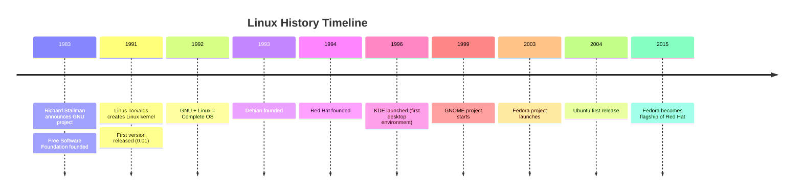
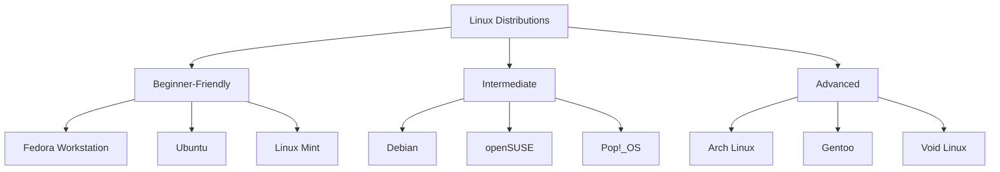

# Chapter 1: Introduction & Philosophy

## Learning Objectives

By the end of this chapter, you will be able to:

- [x] Understand what Linux is and its history
- [x] Explain the open-source philosophy and why it matters
- [x] Identify different Linux distributions and their use cases
- [x] Recognize why Linux is essential for developers
- [x] Navigate the Linux ecosystem confidently

## Prerequisites

**None!** This is your starting point. Welcome to Linux!

---

## What Is Linux?

### The Kernel, Not the Operating System

Technically speaking, **Linux is a kernel** — the core component that manages hardware resources and enables software to communicate with the CPU, memory, and devices. The complete operating system that you use is better described as **GNU/Linux**, combining:

- The **Linux kernel** (created by Linus Torvalds in 1991)
- **GNU tools** (shell, file utilities, compilers — started by Richard Stallman in 1983)
- **Desktop environments** (GNOME, KDE, XFCE)
- **Package managers** (dnf, apt, pacman)

> **Analogy:** If an OS were a car, Linux would be the engine, and GNU would be the steering wheel, transmission, and other systems that make it drivable.

### A Brief History



**1991:** A young Finnish student named **Linus Torvalds** posted a message to a newsgroup:

> "I'm doing a (free) operating system (just a hobby, won't be big and professional like GNU)..."
>
> — Linus Torvalds, August 1991

That "hobby" now powers:
- 100% of the world's top 500 supercomputers
- 96% of the world's web servers
- All Android devices (over 3 billion active users)
- Most cloud infrastructure (AWS, Google Cloud, Azure)
- The International Space Station computers

### Linux vs. Windows vs. macOS

| Feature | Linux | Windows | macOS |
|---------|-------|---------|-------|
| **Source Code** | Open (anyone can view/modify) | Closed (proprietary) | Closed (proprietary) |
| **Cost** | Free | $100-$200+ | Included with Apple hardware |
| **Customization** | Unlimited | Limited | Limited |
| **Package Management** | Central repositories | Manual downloads | App Store + manual |
| **Privacy** | Full control | Data collection concerns | Data collection concerns |
| **Development** | Native environment | WSL/secondary | Unix-based but closed |
| **Gaming** | Improving rapidly (Proton/Steam) | Excellent | Moderate |

---

## The Open-Source Philosophy

### "Free Software" Doesn't Mean "Zero Cost"

In the open-source world, **"free"** refers to **freedom**, not price. The **Free Software Movement** defines four essential freedoms:

1. **Freedom 0:** The freedom to run the program as you wish, for any purpose
2. **Freedom 1:** The freedom to study how the program works, and change it
3. **Freedom 2:** The freedom to redistribute copies so you can help others
4. **Freedom 3:** The freedom to distribute copies of your modified versions

> **Think of it like a recipe:** When you buy a recipe book, you can cook the food (Freedom 0), modify the recipe (Freedom 1), share the original with friends (Freedom 2), and share your improved version (Freedom 3).

### Open Source vs. Free Software

| Philosophy | Focus | Key Organization |
|------------|-------|------------------|
| **Free Software** | Ethics, user rights | Free Software Foundation (FSF) |
| **Open Source** | Practical benefits, methodology | Open Source Initiative (OSI) |

Both movements support the same software, but with different emphasis:
- **Free Software:** "It's morally wrong to deny users these freedoms"
- **Open Source:** "This development method produces better software"

### Why Open Source Matters for You

#### 1. **Learning and Transparency**

You can read the source code of any tool you use. Want to know how `ls` works? Just read it!

```bash
# View the source code of core utilities
# These are the actual programs you'll use daily
$ cat /usr/bin/ls
```

#### 2. **Security Through Transparency**

With millions of eyes on the code, vulnerabilities are found and fixed quickly. No security through obscurity.

#### 3. **No Vendor Lock-in**

If a project dies or goes in a direction you don't like, you can fork it and continue development.

#### 4. **Career Opportunities**

Open source is your public portfolio. Contributing to projects demonstrates real skills to employers.

---

## Why Linux for Developers?

### 1. **Your Production Environment**

Linux runs the internet. When you deploy code, it's almost certainly going to Linux. Developing on Linux eliminates environment mismatches.

### 2. **Native Developer Tools**

Linux has everything you need built-in:

```bash
# Package managers give you instant access to tools
$ sudo dnf install python3 nodejs git docker
# One command. No downloads, no installers, no restarts.
```

### 3. **The Terminal Is Power**

The command line is:
- **Faster** than GUI for most operations
- **Scriptable** — automate repetitive tasks
- **Remote-friendly** — work on servers anywhere
- **Documentable** — copy commands to share knowledge

### 4. **Better Resource Management**

Linux respects your RAM and CPU. No forced updates, no background processes you can't disable.

### 5. **Containerization and Cloud**

Docker, Kubernetes, and cloud-native technologies were built on Linux. You'll use them every day as a developer.

---

## Choosing a Distribution

Linux comes in different "flavors" called **distributions** (or "distros"). Each includes the Linux kernel plus different tools, desktop environments, and philosophies.

### Distribution Categories



### Our Course Distributions: Fedora & Debian

| Aspect | Fedora | Debian |
|--------|--------|--------|
| **Philosophy** | Cutting-edge, latest software | Stable, rock-solid |
| **Release Cycle** | Every ~6 months | When ready (2-3 years) |
| **Package Manager** | dnf (RPM-based) | apt (DEB-based) |
| **Best For** | New hardware, developers, enthusiasts | Servers, production, stability |
| **Parent/Child** | Upstream for RHEL | Upstream for Ubuntu, Mint |
| **Community** | Red Hat sponsored | Community-driven |

**Fedora Workstation** is recommended for this course because:
- Latest software versions
- Excellent GNOME integration
- Developer-focused
- Sponsored by Red Hat (major employer)

**Debian** is ideal for:
- Learning server administration
- Production deployments
- Understanding the foundation of Ubuntu-based systems

### Other Notable Distributions

| Distribution | Use Case |
|--------------|----------|
| **Ubuntu** | Most popular beginner distro, based on Debian |
| **Linux Mint** | Windows-like experience, very beginner-friendly |
| **Pop!_OS** | Ubuntu-based, optimized for developers |
| **Arch Linux** | Rolling release, DIY, advanced users |
| **Kali Linux** | Penetration testing and security |
| **Raspberry Pi OS** | Single-board computers, education |

---

## The Linux Ecosystem

### Desktop Environments

Unlike Windows or macOS, Linux lets you choose your complete desktop experience:

| Desktop Environment | Characteristics | Resource Usage | Best For |
|---------------------|-----------------|----------------|----------|
| **GNOME** | Modern, gesture-based, default on Fedora | Medium | Most users, modern workflows |
| **KDE Plasma** | Highly customizable, Windows-like | Low-Medium | Power users, Windows refugees |
| **XFCE** | Lightweight, traditional | Low | Older hardware, minimalists |
| **Cinnamon** | Traditional, similar to Windows 7 | Low | Windows users |

**This course uses GNOME** — the default on Fedora and Debian, modern, and well-documented.

### Package Managers

| Package Manager | Distributions |
|-----------------|---------------|
| **dnf** (Fedora) | Fedora, RHEL, CentOS |
| **apt** (Debian) | Debian, Ubuntu, Linux Mint |
| **pacman** (Arch) | Arch Linux, Manjaro |
| **zypper** | openSUSE |

---

## Summary

**Key Takeaways:**

- **Linux is a kernel**, part of the GNU/Linux operating system
- **Open source** means freedom to use, study, modify, and share software
- **Linux dominates** servers, cloud, supercomputers, and mobile (Android)
- **Fedora** (cutting-edge) and **Debian** (stable) are our course distributions
- **GNOME** is the desktop environment we'll use
- **Linux is essential** for developers — it's your production environment

**Next Up:** You'll install Linux on your machine in Chapter 2!

---

## Chapter Quiz

Test your understanding of Linux philosophy and fundamentals:

{{#quiz ../../quizzes/chapter-01.toml}}

---

## Exercises

### Exercise 1: Explore the Linux Timeline

Visit the following resources and identify three facts about Linux history that surprised you:

1. Watch Linus Torvalds' 2016 TED Talk: "The mind behind Linux"
2. Browse the Linux Foundation's history page
3. Check out the Unix timeline

**Deliverable:** Write a brief paragraph about the most surprising fact and why it matters.

### Exercise 2: Compare Fedora and Debian

Research the latest versions of both distributions and answer:

1. What are the kernel versions in each?
2. What desktop environment do they default to?
3. Name one advantage of each distribution
4. Which one would you choose for your personal laptop and why?

**Deliverable:** A comparison table or bulleted list.

### Exercise 3: Find Open Source Around You

List 5 technologies or services you use that are open source. For each, identify:

1. The project name
2. What programming language it's written in
3. One way you could contribute (even as a beginner)

**Examples to get you started:** Firefox, VLC, Blender, VS Code, Python...

### Exercise 4: Philosophy Reflection

Answer this question in 100-200 words:

> "Why does the freedom to study and modify software matter for a developer? How would your career be different if all software were proprietary?"

---

## Expected Output

After completing these exercises, you should have:

1. **Timeline Notes:** A list of 3+ interesting facts from Linux history
2. **Distribution Comparison:** A documented choice between Fedora and Debian with reasoning
3. **Open Source Inventory:** A list of 5+ open source projects you use
4. **Philosophy Reflection:** A written reflection on software freedom

---

## Further Reading

- [The Linux Kernel Archives](https://www.kernel.org/)
- [Free Software Foundation](https://www.fsf.org/)
- [DistroWatch](https://distrowatch.com/) - Compare hundreds of distributions
- [Linux Journey](https://linuxjourney.com/) - Interactive learning resource

---

## Discussion Questions

1. Why do you think all supercomputers run Linux?
2. What are the trade-offs between "bleeding edge" (Fedora) and "stable" (Debian) distributions?
3. How does open source change the relationship between software creators and users?
4. What would happen if the Linux kernel suddenly became proprietary?
