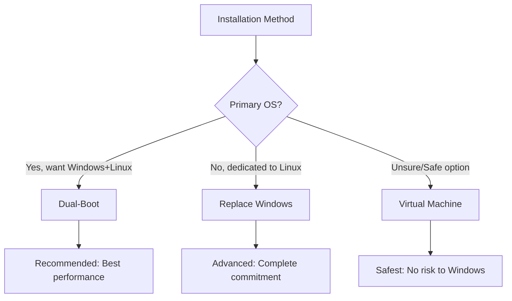
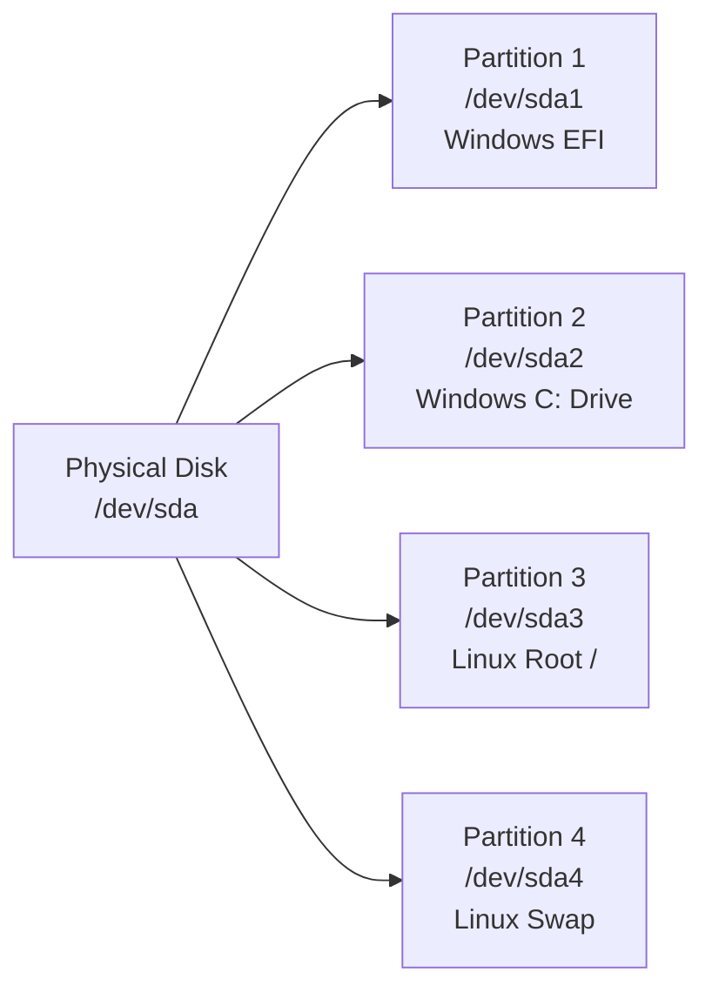

# Chapter 2: Installation

## Learning Objectives

By the end of this chapter, you will be able to:

- [x] Create a bootable Linux USB drive
- [x] Understand disk partitioning basics
- [x] Install Linux in a dual-boot configuration
- [x] Set up Linux in a Virtual Machine
- [x] Configure your system after first boot

## Prerequisites

- Completed Chapter 1
- 8GB+ USB drive (for bootable media)
- Backed up important data (always backup before disk operations!)
- Internet connection

---

## Pre-Installation Checklist

### Hardware Requirements

| Component | Minimum | Recommended |
|-----------|---------|-------------|
| **CPU** | 64-bit processor | Modern multi-core |
| **RAM** | 4 GB | 8 GB+ |
| **Storage** | 20 GB free space | 50 GB+ SSD |
| **USB** | 4 GB | 8 GB+ (for bootable media) |

### Know Your System

Before installing, identify your current setup:

```bash
# On Windows: Open System Information
# Press Win+R, type "msinfo32", press Enter

# Note down:
# - System Type (64-bit or 32-bit) - You need 64-bit
# - Total RAM
# - Disk partitions and free space
```

### Backup Your Data

**WARNING:** Disk operations can result in data loss. Always backup before installing.

1. **External Drive:** Copy important files to external storage
2. **Cloud Backup:** Use Google Drive, Dropbox, OneDrive
3. **Create a System Image:** Windows has built-in backup tools

### Choose Your Installation Method



**Recommendation for this course:** Start with **Dual-Boot** (preferred) or **Virtual Machine** (safer).

---

## Creating a Bootable USB

### Step 1: Download the ISO

**Fedora Workstation:**
```
https://fedoraproject.org/workstation/
```

**Debian:**
```
https://www.debian.org/distrib/
```

Choose the **64-bit** ISO image (usually ~2-3 GB).

### Step 2: Verify the Download (Optional but Recommended)

This ensures your download wasn't corrupted.

**On Fedora/Linux:**
```bash
# Download checksum file
$ wget https://fedoraproject.org/static/checksums/Fedora-Workstation-40-CHECKSUM

# Verify
$ sha256sum -c Fedora-Workstation-40-CHECKSUM
```

**On Windows:**
```powershell
# Open PowerShell in Downloads folder
certutil -hash Fedora-Workstation-Live-x86_64-40.iso SHA256
```

Compare the output with the checksum on the download page.

### Step 3: Write to USB

#### Option A: Using BalenaEtcher (Cross-Platform, Easiest)

1. Download from [balena.io/etcher](https://www.balena.io/etcher/)
2. Open Etcher
3. **Flash from file:** Select your downloaded ISO
4. **Select target:** Choose your USB drive
5. **Flash!** (this will erase all data on the USB)

#### Option B: Using Fedora Media Writer (Fedora Only)

1. Install Fedora Media Writer from the website
2. Select "Fedora Workstation 40"
3. Choose your USB drive
4. Write

#### Option C: Using `dd` (Linux/Mac, Advanced)

```bash
# WARNING: This can destroy data if you get the device wrong!

# Find your USB device
$ lsblk

# Unmount the drive
$ sudo umount /dev/sdX

# Write the ISO (replace X with your device letter)
$ sudo dd if=Downloads/fedora.iso of=/dev/sdX bs=4M status=progress && sync
```

> **⚠️ CRITICAL:** Be absolutely certain you're writing to the USB drive, not your hard drive!

---

## Understanding Partitions

### What Are Partitions?

A partition is a logical division of a hard drive. Think of it like dividing a large room into smaller rooms — each room can have different furniture (operating systems) and purposes.



### Partition Types

| Type | Purpose | Size Recommendation |
|------|---------|---------------------|
| **EFI System Partition** | Boot files (UEFI) | 512 MB |
| **Root (/)** | System files, applications | 30-50 GB minimum |
| **/home** | User data, documents | Remainder of disk |
| **Swap** | Virtual memory (hibernation) | Equal to RAM size |

### File Systems

| File System | Description | Use Case |
|-------------|-------------|----------|
| **ext4** | Standard Linux filesystem | Most installations |
| **btrfs** | Advanced features, snapshots | Fedora default, data safety |
| **xfs** | High performance, large files | Servers, large datasets |
| **NTFS** | Windows filesystem | Windows compatibility |

### Partition Layout Example

```
Physical Disk (250 GB SSD)
├── /dev/sda1 (512 MB)  - EFI System Partition (Windows boot)
├── /dev/sda2 (100 GB)  - Windows C: Drive
├── /dev/sda3 (100 GB)  - Linux Root (/) with btrfs
└── /dev/sda4 (8 GB)    - Linux Swap (for hibernation)
```

---

## Dual-Boot Installation (Fedora/Debian)

### What is Dual-Boot?

Dual-booting allows you to have **both Windows and Linux** on the same computer. At startup, you choose which OS to boot.

**Pros:**
- Best of both worlds
- Full hardware performance
- Learn Linux while keeping Windows safety net

**Cons:**
- Requires disk space
- More complex installation
- Boot configuration can be tricky

### Step 1: Prepare Windows

#### Shrink Windows Partition

1. Open **Disk Management** in Windows:
   ```
   Right-click Start → Disk Management
   ```

2. Right-click your C: drive → **Shrink**

3. Enter size to shrink (at least 50 GB, recommended 100 GB+)

4. Click **Shrink** — This creates "Unallocated Space"

> **Note:** If "Shrink" is grayed out or shows very little space:
> - Disable Windows fast startup: Power Options → Choose what power buttons do
> - Disable hibernation: `powercfg /hibernate off` (Run as Administrator)
> - Defragment your drive

#### Disable Fast Startup (Important!)

Windows "Fast Startup" can cause problems with dual-boot:

1. Open **Control Panel** → **Power Options**
2. Click **"Choose what the power buttons do"**
3. Click **"Change settings that are currently unavailable"**
4. Uncheck **"Turn on fast startup"**
5. Save changes

### Step 2: Boot from USB

1. Insert your bootable USB
2. **Restart** your computer
3. Enter boot menu (usually one of these keys):
   - **F12** — Dell, Lenovo, many others
   - **F10** — HP
   - **F2** or **Del** — Some systems
   - **Esc** — Some systems
   - Hold **Option** ⌥ — Mac

4. Select your USB drive from the boot menu

### Step 3: Install Fedora

#### Boot Menu

1. Select **"Start Fedora Workstation 40"** (or your version)
2. Press Enter to boot
3. Select **"Install to Hard Drive"** from the desktop

#### Installation Steps

**1. Language Selection**
- Select your language and keyboard
- Click **Continue**

**2. Installation Summary**

You'll see several sections:

| Section | Action |
|---------|--------|
| **LOCALIZATION** | Set your time zone |
| **SOFTWARE** | Accept defaults (or add development tools) |
| **SYSTEM** | Configure installation destination |
| **USER** | Create your user account |

**3. Installation Destination** (CRITICAL!)

Click **Installation Destination** → You'll see your disks:

```
Disk: 250 GB
├── sda1: 512 MB   (EFI)
├── sda2: 150 GB   (Windows C:)
└── Free Space: 99.5 GB (Unallocated)
```

Select your disk and choose:
- ✅ **Automatically configure partitioning**
- OR select **"Free Space"** and choose **Custom** for control

**4. User Creation**

- **Full Name:** Your actual name
- **Username:** lowercase, no spaces (e.g., `jdoe`)
- **Password:** Use a strong password
- ☑️ **Make this user administrator**

**5. Begin Installation**

Click **Begin Installation** and wait 10-30 minutes.

### Step 4: First Boot

1. Remove USB when prompted
2. Reboot
3. You should see **GRUB** boot menu:
   ```
   Fedora Workstation (default)
   Advanced options for Fedora
   Windows Boot Manager (on /dev/sda1)
   ```

4. If you don't see Windows option, don't panic — see Troubleshooting below

### Step 5: Post-Install Configuration

On first boot, you'll go through initial setup:

1. **Privacy Settings:** Enable or disable location services
2. **Online Accounts:** Connect Google, Nextcloud, etc. (optional)
3. **Software:** Wait for updates to install

---

## Virtual Machine Installation

### What is a Virtual Machine?

A VM runs Linux inside your current OS as a regular application. It's like having a computer within your computer.

**Pros:**
- **Safest option** — No risk to Windows
- Easy to delete and start over
- Great for testing and learning

**Cons:**
- Slower performance
- Limited graphics/Gaming
- Shared resources with host

### Recommended VM Software

| Software | Cost | License | Best For |
|----------|------|---------|----------|
| **VirtualBox** | Free | Open Source | Beginners, cross-platform |
| **VMware Workstation Player** | Free | Proprietary | Windows host, better performance |
| **GNOME Boxes** | Free | Open Source | Linux host, simple |
| **QEMU/KVM** | Free | Open Source | Advanced users, best performance |

### Installing with VirtualBox (Recommended)

#### Step 1: Install VirtualBox

Download from [virtualbox.org](https://www.virtualbox.org/)

#### Step 2: Create a New VM

1. Click **New**
2. Name: `Fedora Linux` → Type: Linux → Version: Fedora 64-bit
3. Memory: At least 4096 MB (4 GB)
4. Create Virtual Hard Disk:
   - VDI format
   - Dynamically allocated
   - At least 50 GB

#### Step 3: Configure VM Settings

**System → Motherboard:**
- Enable **EFI** (special features)
- Base Memory: 4096 MB+
- Processor: 2+ CPUs

**Display:**
- Video Memory: 128 MB
- Enable **3D Acceleration**

**Storage:**
- Click "Adds optical drive"
- Select your Fedora ISO file

**Network:**
- Attached to: NAT

#### Step 4: Install Linux

1. Start the VM
2. Follow the same installation steps as dual-boot
3. The VM will automatically use the entire virtual disk

#### Step 5: Install Guest Additions (Optional)

After installation, this improves performance:

1. In VM menu: **Devices** → **Insert Guest Additions CD image**
2. In Linux terminal:
   ```bash
   $ sudo dnf install virtualbox-guest-additions
   $ reboot
   ```

---

## First Boot Configuration

### Initial Setup Wizard

After installation boots, complete these steps:

#### 1. **Welcome to GNOME**

Follow the on-screen prompts to:
- Select language
- Connect to WiFi
- Set privacy settings

#### 2. **System Updates**

```bash
# Update your system immediately after first boot
$ sudo dnf upgrade
```

Or via GNOME Software: Updates → Download & Install

#### 3. **Install Essential Software**

```bash
# Fedora - Essential development tools
$ sudo dnf install @development-tools
$ sudo dnf install vim neovim git code
$ sudo dnf install ffmpeg vlc gimp
```

```bash
# Debian - Equivalent packages
$ sudo apt update
$ sudo apt upgrade
$ sudo apt install build-essential git vim
$ sudo apt install vlc gimp
```

#### 4. Enable Flathub (Additional Software)

GNOME Software can access Flathub, a large software repository:

1. Open GNOME Software
2. Click the menu → Software Repositories
3. Enable **Flathub**

---

## Troubleshooting

### Windows Not Showing in Boot Menu

If GRUB doesn't show Windows:

```bash
# Boot into Linux and update GRUB
$ sudo os-prober
$ sudo grub2-mkconfig -o /boot/grub2/grub.cfg
# For UEFI:
$ sudo grub2-mkconfig -o /boot/efi/EFI/fedora/grub.cfg
```

### Computer Boots Directly to Windows

If you can't access Linux at all:

1. Boot into BIOS/UEFI (F2, Del, F10)
2. Find **Boot Order** settings
3. Change boot order to prioritize Linux boot manager
4. Save and exit

### Graphics/Display Issues

If the display is wrong:

```bash
# For NVIDIA cards
$ sudo dnf install rpmfusion-free-release-tainted
$ sudo dnf install akmod-nvidia xorg-x11-drv-nvidia-cuda
```

### WiFi Not Working

Some proprietary WiFi drivers need manual installation:

```bash
# Identify your WiFi card
$ lspci | grep -i network

# Install extra drivers
$ sudo dnf install https://download1.rpmfusion.org/free/fedora/rpmfusion-free-release-$(rpm -E %fedora).noarch.rpm
$ sudo dnf update
```

---

## Summary

**Key Takeaways:**

- **Backup first** — Always backup before disk operations
- **Dual-boot** for performance, **VM** for safety
- **Shrink Windows** to create space for Linux
- **UEFI + GPT** is the modern standard (not BIOS/MBR)
- **First boot:** Update system, install essential tools
- **GRUB** manages boot selection between OSes

**Installation Methods Compared:**

| Method | Performance | Safety | Complexity |
|--------|-------------|--------|------------|
| **Dual-Boot** | ⭐⭐⭐⭐⭐ | ⭐⭐⭐ | ⭐⭐⭐⭐ |
| **Virtual Machine** | ⭐⭐⭐ | ⭐⭐⭐⭐⭐ | ⭐⭐ |

---

## Chapter Quiz

Test your understanding of Linux installation methods and concepts:

{{#quiz ../../quizzes/chapter-02.toml}}

---

## Exercises

### Exercise 1: Pre-Installation Assessment

Create a document answering:

1. What is your current system specification?
   - CPU model and cores
   - RAM amount
   - Disk size and free space
   - Graphics card

2. Which installation method will you use and why?
   - Dual-boot, VM, or replace Windows?
   - Justify your choice

3. How much space will you allocate to Linux?

**Deliverable:** A brief document with your system specs and installation plan.

### Exercise 2: Create a Bootable USB

1. Download Fedora Workstation ISO
2. Verify the checksum (SHA256)
3. Create a bootable USB using BalenaEtcher
4. Boot from the USB (don't install yet, just verify it works)

**Deliverable:** A photo/screenshot of the Fedora boot menu.

### Exercise 3: Partition Planning

Draw a diagram showing how you would partition a 500 GB disk for dual-boot:

- Windows: 200 GB
- Linux: Remaining space

Show the partition layout with:
- Device names (/dev/sda1, /dev/sda2, etc.)
- Partition types (EFI, NTFS, ext4/btrfs, swap)
- Mount points (/, /home, swap)

**Deliverable:** A diagram (ASCII art or hand-drawn photo).

### Exercise 4: Complete Installation Lab

Perform a full installation:

**If Dual-Boot:**
1. Shrink Windows partition
2. Install Linux alongside Windows
3. Verify both OSes boot correctly

**If VM:**
1. Create a virtual machine
2. Install Linux inside it
3. Install guest additions

**Deliverable:**
- Screenshot of both Windows and Linux boot menus
- Screenshot of Linux desktop after first boot
- List any issues encountered and how you solved them

---

## Expected Output

After completing these exercises, you should have:

1. **System Assessment:** Documented specs and installation plan
2. **Bootable USB:** Working Fedora or Debian USB drive
3. **Partition Diagram:** Clear understanding of disk layout
4. **Working Linux Installation:** System you can boot and use

---

## Further Reading

- [Fedora Installation Guide](https://docs.fedoraproject.org/en-US/fedora/latest/install-guide/)
- [Debian Installation Manual](https://www.debian.org/releases/stable/amd64/install.en.html)
- [VirtualBox Manual](https://www.virtualbox.org/manual/UserManual.html)
- [Arch Wiki: Partitioning](https://wiki.archlinux.org/title/Partitioning)

---

## Discussion Questions

1. Why might someone choose a VM over dual-boot, or vice versa?
2. What are the risks of dual-booting? How can they be mitigated?
3. Why does Linux use different file systems (ext4, btrfs) than Windows (NTFS)?
4. How would you recover if the installation failed and Windows wouldn't boot?
