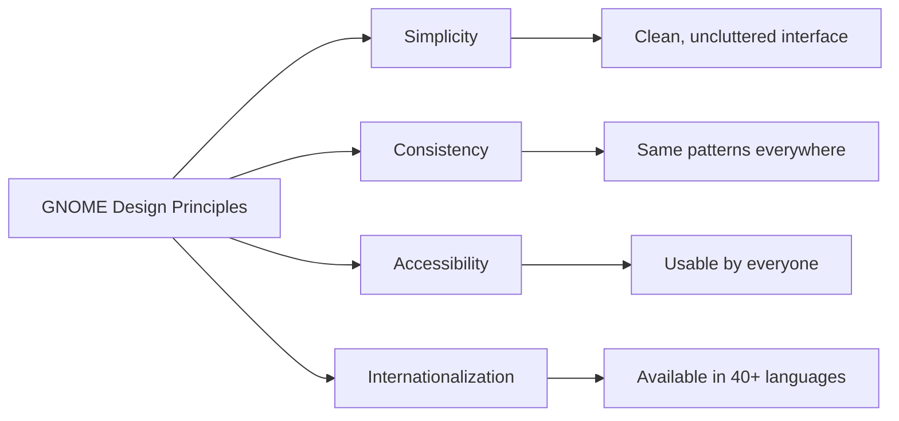
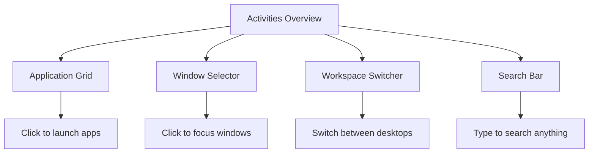

# Chapter 3: GNOME Desktop

## Learning Objectives

By the end of this chapter, you will be able to:

- [x] Navigate the GNOME desktop environment confidently
- [x] Use the Activities overview and application launcher
- [x] Customize your desktop with themes and extensions
- [x] Manage windows, workspaces, and virtual desktops
- [x] Install applications via GNOME Software

## Prerequisites

- Completed Chapter 2
- Linux installed and running
- Working internet connection

---

## GNOME Overview

### What is GNOME?

**GNOME** (GNU Network Object Model Environment) is a complete desktop environment for Linux. It provides:

- **Graphical User Interface (GUI)** — Point-and-click interaction
- **Core Applications** — File manager, web browser, terminal, settings
- **System Integration** — Manages displays, audio, notifications

### GNOME Philosophy

GNOME follows a **modern, minimal** design philosophy:



**Key Design Elements:**
- **Top Bar:** System status, clock, notifications
- **Activities Overview:** Application launcher and window manager
- **Dash:** Favorite applications dock
- **Dynamic Workspaces:** Automatic virtual desktop management

### GNOME vs Other Desktop Environments

| Feature | GNOME | KDE Plasma | XFCE |
|---------|-------|------------|------|
| **Philosophy** | Modern, minimal | Highly customizable | Traditional, lightweight |
| **Resource Usage** | Medium | Low-Medium | Low |
| **Default on** | Fedora, Debian, Ubuntu | Kubuntu, KDE neon | Xubuntu, Mint XFCE |
| **Touch/Gestures** | Excellent | Good | Basic |
| **Learning Curve** | Medium | Low-Medium | Low |

---

## Desktop Navigation

### The GNOME Layout

```
┌─────────────────────────────────────────────────────────┐
│  [Activities] [App Name]       □      🌙 📶 🔋 2:45 PM  │ ← Top Bar
├─────────────────────────────────────────────────────────┤
│                                                         │
│                                                         │
│                    Desktop Area                          │
│                    (or Windows)                          │
│                                                         │
│                                                         │
├─────────────────────────────────────────────────────────┤
│              [🔍]  [📁]  [🖥️]  [⚙️]  [📧]                │ ← Dash
└─────────────────────────────────────────────────────────┘
```

### The Top Bar

The top bar is your command center:

```
┌─────────────────────────────────────────────────────────────────┐
│ [Activities] [Application Menu]      [Status] [Calendar] [Sys] │
└─────────────────────────────────────────────────────────────────┘
      ↓              ↓                      ↓          ↓
   Click to see   Current app's         Volume,     Notifications,
   Activities     menu (if open)        network,    calendar, power
                  (or "Activities")     battery
```

**Components:**
- **Activities Button** (top-left): Opens overview
- **Application Menu** (center): Current app's menu
- **Status Indicators** (right): System tray icons
- **Clock** (right): Click for calendar and notifications
- **System Menu** (far-right): Settings, power, logout

**Try this:** Click the clock to see the calendar and notifications!

### Keyboard Shortcuts (Essential!)

Master these to become efficient:

| Action | Shortcut |
|--------|----------|
| **Open Activities Overview** | `Super` (Windows key) or `Alt+F1` |
| **Application Search** | `Super`, then type |
| **Switch Windows** | `Alt+Tab` |
| **Switch Workspaces** | `Super+PageUp/PageDown` |
| **Show All Applications** | `Super+A` |
| **Open Terminal** | `Super+Enter` (if configured) |
| **Close Window** | `Alt+F4` or `Super+Q` |
| **Hide Window** | `Super+H` |
| **Lock Screen** | `Super+L` |
| **Screenshot** | `PrintScreen` |

> **💡 Pro Tip:** The `Super` key is the Windows key on most keyboards. macOS users can use `Command` in most cases.

---

## Activities Overview

### What is Activities Overview?

The **Activities Overview** is GNOME's central hub. Press the `Super` key to activate it.



### Navigating the Overview

#### Opening Applications

1. **Press `Super`** to open Activities
2. Click the grid icon (bottom-left) to show **All Applications**
3. Scroll or search to find your app
4. Click to launch

#### Switching Between Windows

1. **Press `Super`** for Activities
2. Click on any window thumbnail to focus it
3. Or press `Alt+Tab` for quick switching

#### Managing Workspaces

1. **Press `Super`** for Activities
2. Look at the right side — you'll see **workspaces**
3. Drag windows between workspaces
4. Click a workspace to switch to it

### Search from Activities

The search bar in Activities is powerful:

```bash
# Type in the search bar to find:
> firefox          # Launch applications
> "document"       # Find files by name
> "wifi"           # Search settings
> calc             # Calculator
>                 # Web search (if enabled)
```

**Search Categories:**
- Applications
- Settings
- Files (indexed in your home directory)
- Calculator (type equations)
- Web search (optional)

### Pinned Favorites (Dash)

The **Dash** is the dock at the bottom of the screen with your favorite apps.

**To add a favorite:**
1. Open Activities → All Applications
2. Right-click an app
3. Select **"Add to Favorites"**

**To remove a favorite:**
1. Right-click the app in the Dash
2. Select **"Remove from Favorites"**

---

## Window Management

### Window Actions

| Action | Mouse | Keyboard |
|--------|-------|----------|
| **Move window** | Drag title bar | `Alt+F7` then arrows |
| **Resize window** | Drag edges/corners | `Alt+F8` then arrows |
| **Maximize** | Click maximize button | `Super+↑` or `Alt+F10` |
| **Unmaximize** | Click unmaximize | `Super+↓` |
| **Minimize/Hide** | Click minimize | `Super+H` |
| **Close** | Click × or `Alt+F4` | `Alt+F4` |
| **Always on Top** | Right-click title bar | Not available by default |

### Tiling Windows (Snap to Edge)

Drag a window to the edge of the screen to tile it:

```
┌──────────────────────────────────────────────┐
│         Drag to left edge:                   │
│ ┌──────────┬─────────────────────────────────┐│
│ │          │                                 ││
│ │ Window 1 │        Empty / Window 2         ││
│ │  (50%)   │            (50%)                ││
│ └──────────┴─────────────────────────────────┘│
└──────────────────────────────────────────────┘

         Drag to corner: Quarter screen
```

**Keyboard Tiling:**
- `Super+←` → Left half
- `Super+→` → Right half
- `Super+↑` → Maximize
- `Super+↓` → Restore/Minimize

### Virtual Workspaces

GNOME uses **dynamic workspaces** — they're created and destroyed as needed.

**Understanding Workspaces:**

```
Workspace 1: Browser, Terminal
Workspace 2: Code Editor, File Manager
Workspace 3: Music, Chat
```

**Workspace Shortcuts:**
| Action | Shortcut |
|--------|----------|
| Switch to next workspace | `Super+PageDown` |
| Switch to previous workspace | `Super+PageUp` |
| Move window to next workspace | `Super+Shift+PageDown` |
| Open new workspace | Just drag a window to empty space |

---

## Customization (Themes, Extensions)

### GNOME Settings Overview

Open Settings via:
- **System Menu** → **Settings** (gear icon)
- **Activities** → Search "Settings"
- Terminal: `gnome-control-center`

### Appearance Settings

**Settings → Appearance:**

```
┌─────────────────────────────────────────┐
│  Appearance                             │
├─────────────────────────────────────────┤
│  Style:                                 │
│  ○ Light   ● Dark   ○ Dark with Accent  │
│                                         │
│  Accent Color:                          │
│  ● Blue   ○ Green   ○ Orange, etc.      │
│                                         │
│  Background: [Change...]                │
│  Lock Screen: [Change...]               │
│  Application Icons: [Adwaita]           │
└─────────────────────────────────────────┘
```

**Dark Mode:**
```bash
# Terminal command to toggle dark mode
$ gsettings set org.gnome.desktop.interface gtk-theme 'Adwaita-dark'
```

### Desktop Background

**To change wallpaper:**
1. Open **Settings → Appearance**
2. Click **Background** or **Lock Screen**
3. Choose from defaults or click **Add Picture...**

**Supported formats:** JPG, PNG, WebP, SVG

### GNOME Extensions

**Extensions** add functionality to GNOME. Think of them like browser extensions for your desktop.

#### Popular Extensions

| Extension | Purpose |
|-----------|---------|
| **Dash to Dock** | Transform the Dash into a configurable dock |
| **AppIndicator/KStatusNotifierItem** | Tray icons (Discord, Spotify, etc.) |
| **ArcMenu** | Windows-style start menu |
| **Blur my Shell** | Blur effects on overview, dash |
| **GSConnect** | Pair Android phone with desktop |
| **Caffeine** | Prevent screen from automatically locking |

#### Installing Extensions

**Method 1: GNOME Software (Easiest)**

1. Open **GNOME Software**
2. Search for "Extensions" app
3. Install **"Extensions"** (the manager app)
4. Browse and install extensions directly

**Method 2: Web Browser**

1. Visit [extensions.gnome.org](https://extensions.gnome.org/)
2. Browse extensions
3. Toggle switch to install (requires browser extension)
4. Open **Extensions** app to manage

**Method 3: Terminal (Advanced)**

```bash
# Install GNOME Shell integration
$ sudo dnf install gnome-shell-extensions

# Install specific extensions
$ sudo dnf install gnome-shell-extension-dash-to-dock
$ sudo dnf install gnome-shell-extension-appindicator
```

#### Managing Extensions

Open the **Extensions** app to:
- Enable/disable extensions
- Configure extension settings
- Remove unwanted extensions

> ⚠️ **Warning:** Some extensions can cause system instability. Install only what you need.

### Font Customization

**Settings → Fonts:**

| Setting | Description | Default |
|---------|-------------|---------|
| **Interface Text** | UI font | Cantarell 11 |
| **Document Text** | Document reading | Sans 11 |
| **Monospace Text** | Code, terminal | Monospace 11 |
| **Legacy Window Titles** | Older apps | Sans 11 |
| **Antialiasing** | Smooth edges | Subpixel |
| **Scaling Factor** | Text size | 1.0 |

**Terminal:**
```bash
# Change interface font size
$ gsettings set org.gnome.desktop.interface document-font-name 'Sans 12'

# Change monospace font
$ gsettings set org.gnome.desktop.interface monospace-font-name 'Monospace 12'
```

---

## System Settings

### Essential Settings to Configure

#### 1. Network (WiFi & Ethernet)

**Settings → Network**

```bash
# Quick status check in terminal
$ nmcli connection show
$ nmcli device wifi list
```

**Connect to WiFi:**
1. Click the network icon in top bar
2. Select your network
3. Enter password

**Forgetting a network:**
1. Settings → Network
2. Click the gear icon next to the network
3. Click **Forget**

#### 2. Display & Monitors

**Settings → Display**

- **Resolution:** Usually auto-detected
- **Scale:** For high-DPI (4K/Retina) displays
- **Refresh Rate:** Higher = smoother motion

**Multiple Monitors:**
```
┌────────────────┐  ┌────────────────┐
│   Display 1    │  │   Display 2    │
│   (Primary)    │  │   (Secondary)  │
└────────────────┘  └────────────────┘
       [Set as Primary] [Arrange]
```

**Arrangement:** Drag displays to match physical layout.

#### 3. Sound & Volume

**Settings → Sound**

| Setting | Purpose |
|---------|---------|
| **Output** | Speakers/headphones |
| **Input** | Microphone |
| **System Sounds** | Alert sounds |
| **Volume** | Master volume level |

**Quick Mute:** Click volume icon → select **Mute**

#### 4. Power & Battery

**Settings → Power**

| Profile | Use Case |
|---------|----------|
| **Balanced Power** | Default for most users |
| **Power Saver** | Extend battery life |
| **Performance** | Maximum performance (plugged in) |

**Battery Saver:**
```bash
# Check battery status
$ upower -i /org/freedesktop/UPower/devices/battery_BAT0
```

#### 5. Privacy

**Settings → Privacy**

Important settings:
- **Location Services:** Disable for privacy
- **Camera & Microphone:** Control app access
- **Usage & History:** Clear usage data
- **Screen Lock:** Set timeout and password requirement

#### 6. Users

**Settings → Users**

- **Add User:** Create additional accounts
- **Automatic Login:** Skip login screen (convenient but less secure)
- **Parental Controls:** Limit app usage (for families)

> ⚠️ **Security Tip:** Disable automatic login for laptops and shared computers.

---

## Installing GUI Applications

### GNOME Software

**GNOME Software** is your GUI app store:

```
┌─────────────────────────────────────────┐
│  GNOME Software                         │
├─────────────────────────────────────────┤
│  [Explore] [Installed] [Updates]        │
│                                         │
│  Featured Applications:                 │
│  ┌─────────┐  ┌─────────┐  ┌─────────┐ │
│  │ Firefox │  │  VLC    │  │  GIMP   │ │
│  │  Browser│  │ Player  │  │  Image  │ │
│  │ [Install]│ [Install]│ [Install]│ │
│  └─────────┘  └─────────┘  └─────────┘ │
└─────────────────────────────────────────┘
```

**To install:**
1. Open **GNOME Software**
2. Browse or search for an app
3. Click **Install**

**To remove:**
1. Click **Installed** tab
2. Find the app
3. Click **Remove**

### Flatpak (Flathub)

Many apps are available as **Flatpaks** — containerized packages that work on any distro.

```bash
# Install Flatpak support (Fedora has it by default)
$ sudo dnf install flatpak

# Add Flathub repository
$ sudo flatpak remote-add --if-not-exists flathub https://flathub.org/repo/flathub.flatpakrepo

# Install an app
$ flatpak install flathub com.spotify.Client

# Run the app
$ flatpak run com.spotify.Client
```

**Popular Flathub Apps:**
- Spotify
- Discord
- VS Code
- LibreOffice
- OBS Studio
- Steam

### Finding Applications

| Category | Recommended Apps |
|----------|------------------|
| **Web Browsers** | Firefox, Chromium, Brave |
| **Office** | LibreOffice, OnlyOffice |
| **Graphics** | GIMP, Inkscape, Krita |
| **Media** | VLC, Audacity, OBS |
| **Communication** | Discord, Thunderbird |
| **Development** | VS Code, Sublime Text |

---

## Summary

**Key Takeaways:**

- **GNOME** is the default desktop on Fedora and Debian
- **Activities Overview** (`Super` key) is the central hub
- **Workspaces** provide virtual desktops for organization
- **Extensions** add functionality (use sparingly)
- **GNOME Software** is the GUI app store
- **Keyboard shortcuts** dramatically improve efficiency

**Essential Shortcuts to Memorize:**

| Shortcut | Action |
|----------|--------|
| `Super` | Open Activities |
| `Alt+Tab` | Switch windows |
| `Super+Enter` | Open terminal |
| `Super+L` | Lock screen |
| `PrintScreen` | Screenshot |

---

## Chapter Quiz

Test your understanding of the GNOME desktop environment:

{{#quiz ../../quizzes/chapter-03.toml}}

---

## Exercises

### Exercise 1: GNOME Navigation Scavenger Hunt

Complete these tasks as fast as possible:

1. Open the **Activities Overview**
2. Find and launch **GNOME Terminal**
3. Open a second workspace
4. Move Terminal to workspace 2
5. Switch back to workspace 1
6. Open **GNOME Files** (Nautilus)
7. Maximize the Files window
8. Close the Files window
9. Lock the screen
10. Unlock and return

**Deliverable:** Record your time and list which shortcuts you used.

### Exercise 2: Desktop Customization

Personalize your desktop:

1. Change your desktop background
2. Enable dark mode
3. Add 5 applications to your favorites/dock
4. Install 1 GNOME extension (from Extensions app)
5. Change your interface font size
6. Configure your power settings

**Deliverable:** Screenshots of your customized desktop.

### Exercise 3: Application Installation

Install these applications:

1. **Via GNOME Software:** Install VLC media player
2. **Via Flatpak:** Install Flatpak, add Flathub, install 1 app
3. **Via Terminal (preview):** Use `dnf` to install `tree`

```bash
$ sudo dnf install tree
```

**Deliverable:** List the commands/steps you used for each method.

### Exercise 4: Workspace Workflow

Create a productive workspace setup:

1. **Workspace 1:** Browser + Terminal
2. **Workspace 2:** Files + Text Editor
3. **Workspace 3:** Settings + Software (optional)

Practice switching between workspaces and moving windows.

**Deliverable:** Describe your workspace workflow and how it helps you stay organized.

---

## Expected Output

After completing these exercises, you should have:

1. **Navigation Skills:** Can use GNOME efficiently without mouse
2. **Customized Desktop:** Personalized appearance and setup
3. **Installed Apps:** VLC, Flatpak app, and `tree` command
4. **Workspace Workflow:** Organized multi-desktop setup

---

## Further Reading

- [GNOME Documentation](https://help.gnome.org/)
- [GNOME Shell Extensions](https://extensions.gnome.org/)
- [Fedora Desktop Documentation](https://docs.fedoraproject.org/en-US/docs/desktop/)
- [Flathub Website](https://flathub.org/)

---

## Discussion Questions

1. Why does GNOME hide options compared to Windows/macOS? Is this good or bad?
2. How does GNOME's dynamic workspace model compare to fixed virtual desktops?
3. What are the security implications of installing extensions from the web?
4. Why might someone prefer KDE Plasma or XFCE over GNOME?
