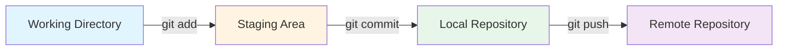
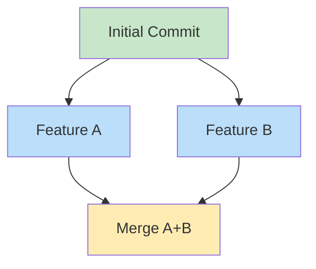
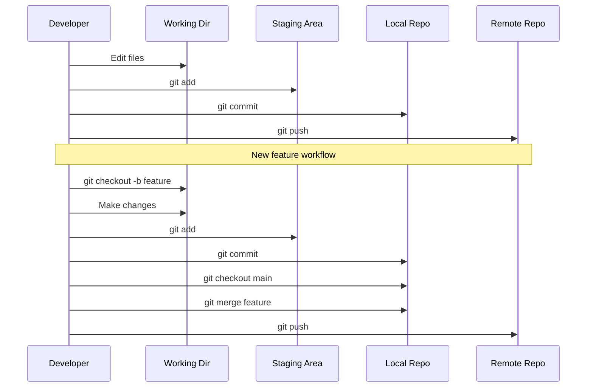

# Chapter 12: Git Version Control

## Learning Objectives

By the end of this chapter, you will be able to:

- [x] Understand what version control is and why it's essential
- [x] Initialize a Git repository
- [x] Track changes with staging and committing
- [x] View commit history and understand the log
- [x] Create and switch between branches
- [x] Merge changes from different branches
- [x] Work with remote repositories (push/pull)

## Prerequisites

- Completed Part III: System Administration
- Basic familiarity with the command line
- Internet connection (for remote repositories)

---

## What Is Version Control?

### The Problem Version Control Solves

Have you ever worked on a project and had files like these?

```
my-script.py
my-script-v2.py
my-script-v2-final.py
my-script-v2-final-REALLY-final.py
my-script-v2-final-working-backup.py
```

**Version control** solves this problem by tracking every change to your files in a structured, efficient way.

### Why Version Control Matters

| Scenario | Without Version Control | With Version Control |
|----------|------------------------|---------------------|
| **Made a mistake** | Restore from backup (hope you have one) | `git revert` - instant undo |
| **Want to experiment** | Copy the entire folder | `git branch` - zero-cost experiments |
| **Collaborate** | Email files back and forth | `git push/pull` - seamless sharing |
| **See history** | Remember when you changed what | `git log` - complete audit trail |
| **Compare versions** | Open files side-by-side manually | `git diff` - automatic highlighting |

### What Is Git?

**Git** is a distributed version control system created by **Linus Torvalds** in 2005 to manage Linux kernel development. It's now the industry standard for version control.

**Key characteristics:**
- **Distributed:** Every developer has a complete copy of the project history
- **Fast:** Operations are local, no server needed for most work
- **Branching:** Creating parallel lines of development is cheap and easy
- **Open Source:** Free to use and modify

---

## Git Concepts

### The Three States

Git has three main areas where files can exist:



1. **Working Directory:** The actual files on your disk
2. **Staging Area (Index):** Files prepared for the next commit
3. **Repository (Local):** Where Git stores committed history

### The Commit Graph

Git stores history as a directed acyclic graph:



Each commit points to its parent(s), creating a complete tree of changes.

---

## Getting Started with Git

### Installation

Git is likely already installed on your Linux system. Check with:

```bash
$ git --version
git version 2.43.0
```

If not installed:

**Fedora:**
```bash
sudo dnf install git
```

**Debian:**
```bash
sudo apt install git
```

### Initial Configuration

Before using Git, set your identity (required for commits):

```bash
git config --global user.name "Your Name"
git config --global user.email "you@example.com"
```

Set a default branch name (modern standard):
```bash
git config --global init.defaultBranch main
```

Set your preferred editor:
```bash
git config --global core.editor nano
```

View your configuration:
```bash
git config --list
```

---

## Basic Git Workflow

### 1. Initialize a Repository

Create a new project or navigate to an existing directory:

```bash
mkdir my-project
cd my-project
git init
```

Output:
```
Initialized empty Git repository in /home/user/my-project/.git/
```

This creates a `.git` directory (hidden) where Git stores all its data.

### 2. Create and Stage Files

Create a file:
```bash
echo "# My Project" > README.md
echo 'print("Hello, Git!")' > main.py
```

Check what Git sees:
```bash
git status
```

Output:
```
On branch main

No commits yet

Untracked files:
  (use "git add <file>..." to include in what will be committed)
	README.md
	main.py
```

Stage the files (add to staging area):
```bash
git add README.md
git add main.py
```

Or stage all files:
```bash
git add .
```

### 3. Make Your First Commit

Create a commit with a descriptive message:
```bash
git commit -m "Initial commit: Add README and main script"
```

Output:
```
[main (root-commit)] Initial commit: Add README and main script
 2 files changed, 2 insertions(+)
 create mode 100644 README.md
 create mode 100644 main.py
```

**Commit Message Best Practices:**
- Start with a verb: "Add", "Fix", "Remove", "Update"
- Keep the first line under 50 characters
- Use imperative mood ("Add feature" not "Added feature")
- Add a blank line, then detailed explanation if needed

---

## Viewing History

### Commit Log

View commit history:
```bash
git log
```

Output:
```
commit a1b2c3d4e5f6... (HEAD -> main)
Author: Your Name <you@example.com>
Date:   Mon Feb 5 10:30:00 2026 +0000

    Initial commit: Add README and main script
```

More readable formats:
```bash
# One line per commit
git log --oneline

# Decorated graph
git log --graph --oneline --all

# With date stats
git log --stat
```

### Viewing Changes

See what changed but not staged:
```bash
git diff
```

See staged changes:
```bash
git diff --staged
```

Compare two commits:
```bash
git diff HEAD~1 HEAD
```

View a specific file at a specific commit:
```bash
git show COMMIT_ID:path/to/file
```

---

## Branching and Merging

### Why Branch?

Branching lets you:
- Work on features independently
- Experiment without breaking the main code
- Maintain multiple versions simultaneously
- Review code before merging

### Creating Branches

List existing branches:
```bash
git branch
```

Create a new branch:
```bash
git branch feature-login
```

Switch to a branch:
```bash
git checkout feature-login
```

Or create and switch in one command:
```bash
git checkout -b feature-login
```

### Working on Branches

Make changes on your new branch:
```bash
echo "# Login Feature" >> README.md
git add README.md
git commit -m "Add login feature documentation"
```

Switch back to main:
```bash
git checkout main
```

### Merging Branches

Merge a branch into the current one:
```bash
git merge feature-login
```

Output (fast-forward merge):
```
Updating a1b2c3d..d4e5f6g
Fast-forward
 README.md | 1 +
 1 file changed, 1 insertion(+)
```

Delete the merged branch:
```bash
git branch -d feature-login
```

### Merge Conflicts

When two branches change the same lines differently, Git creates a **conflict**:

```
<<<<<<< HEAD
print("Version A")
=======
print("Version B")
>>>>>>> feature-login
```

To resolve:
1. Edit the file to choose which version to keep (or combine both)
2. `git add <resolved-file>`
3. `git commit`

---

## Working with Remotes

### Remote Repositories

Remotes are versions of your project hosted elsewhere (GitHub, GitLab, Bitbucket).

### Adding a Remote

After creating a repository on GitHub/GitLab:
```bash
git remote add origin https://github.com/username/repo.git
```

View remotes:
```bash
git remote -v
```

### Pushing Changes

Send your local commits to the remote:
```bash
git push -u origin main
```

The `-u` flag sets the upstream relationship for future pushes.

### Pulling Changes

Get changes from the remote:
```bash
git pull origin main
```

This is equivalent to:
```bash
git fetch origin main    # Download changes
git merge origin/main    # Merge into current branch
```

### Cloning a Repository

Copy an existing repository:
```bash
git clone https://github.com/username/repo.git
cd repo
```

This automatically sets up the remote as `origin`.

---

## Common Git Commands Reference

| Command | Description |
|---------|-------------|
| `git init` | Initialize a new repository |
| `git clone <url>` | Clone an existing repository |
| `git status` | Show working tree status |
| `git add <file>` | Stage changes |
| `git commit -m "message"` | Commit staged changes |
| `git log` | Show commit history |
| `git diff` | Show unstaged changes |
| `git diff --staged` | Show staged changes |
| `git branch` | List/create branches |
| `git checkout <branch>` | Switch branches |
| `git checkout -b <branch>` | Create and switch branch |
| `git merge <branch>` | Merge branch into current |
| `git remote -v` | List remotes |
| `git push` | Push to remote |
| `git pull` | Pull from remote |
| `git stash` | Temporarily save changes |
| `git stash pop` | Restore stashed changes |

---

## Git Workflow Diagram



---

## Summary

**Key Takeaways:**

- **Git** is distributed version control created by Linus Torvalds
- **Three states:** Working directory → Staging area → Repository
- **Branching** allows parallel development without conflicts
- **Commits** are snapshots of your project at points in time
- **Remotes** enable collaboration with other developers
- **Good commit messages** make history understandable

**Git Philosophy:**
- Commit often, commit small
- Write meaningful commit messages
- Use branches for features
- Pull before you push
- Review changes before committing

**Next Up:** You'll learn about Docker containers and how they complement version control for reproducible development environments!

---

## Chapter Quiz

Test your understanding of Git version control:

{{#quiz ../../quizzes/chapter-12.toml}}

---

## Exercises

### Exercise 1: Your First Repository

Create a new Git repository and make some commits:

1. Create a directory called `git-practice`
2. Initialize it as a Git repository
3. Create a file called `notes.md` with some content
4. Stage and commit the file with a descriptive message
5. Add more content to `notes.md` and create a second commit
6. View your commit history with `git log`

**Expected Output:**
```
$ git log --oneline
a1b2c3d Add more notes
7f6e5d4 Initial commit: Add notes.md
```

### Exercise 2: Branching Practice

Practice creating and merging branches:

1. Create a new branch called `experiment`
2. On the `experiment` branch, create a file called `test.txt`
3. Commit the file
4. Switch back to `main`
5. Merge the `experiment` branch into `main`
6. Delete the `experiment` branch
7. Verify the file exists on `main`

**Expected Output:**
```
$ git branch
* main
$ ls
notes.md  test.txt
```

### Exercise 3: Undo Mistakes

Practice Git's undo capabilities:

1. Create a file with content, commit it
2. Modify the file and commit again
3. Use `git reset --soft HEAD~1` to undo the last commit (keeps changes staged)
4. Use `git reset HEAD~1` to unstage changes
5. Use `git checkout -- <file>` to discard working directory changes

**Challenge:** When would you use `git reset --hard`? What's the danger?

### Exercise 4: Merge Conflict Resolution

Practice resolving conflicts:

1. Create a branch called `conflict-test`
2. On `main`, create `conflict.md` with `Version A` and commit
3. Switch to `conflict-test`, modify the same line to `Version B` and commit
4. Switch back to `main` and change the same line to `Version C` and commit
5. Merge `conflict-test` into `main`
6. Resolve the conflict by choosing or combining versions
7. Complete the merge

### Exercise 5: Remote Collaboration (Optional)

If you have a GitHub/GitLab account:

1. Create a new repository on the platform
2. Add it as a remote to your local repository
3. Push your local commits
4. Make a change on the web interface
5. Pull the changes to your local machine
6. Verify the synchronization

---

## Expected Output

After completing these exercises, you should have:

1. **A working Git repository** with multiple commits
2. **Branching experience** — you've created, merged, and deleted branches
3. **Undo skills** — you know how to revert changes at different stages
4. **Conflict resolution** — you've handled and resolved merge conflicts
5. **(Optional) Remote workflow** — you've pushed and pulled from a remote

---

## Further Reading

- [Pro Git Book](https://git-scm.com/book/en/v2) — Free comprehensive Git guide
- [Git Interactive Tutorial](https://learngitbranching.js.org/) — Visual branching practice
- [GitHub Skills](https://skills.github.com/) — Hands-on Git and GitHub practice
- [Git Cheat Sheet](https://education.github.com/git-cheat-sheet-education.pdf)

---

## Common Pitfalls

### Don't Commit Generated Files

Create a `.gitignore` file to exclude:
- Binaries and executables
- Dependencies (`node_modules/`, `venv/`)
- Build artifacts (`*.o`, `*.pyc`)
- IDE settings (`.idea/`, `.vscode/`)
- System files (`.DS_Store`, `Thumbs.db`)

Example `.gitignore`:
```
# Python
__pycache__/
*.py[cod]
venv/

# Node
node_modules/
package-lock.json

# IDE
.vscode/
.idea/
```

### Don't Commit Sensitive Data

Never commit:
- API keys
- Passwords
- Private keys
- Personal data

Use environment variables instead:
```python
# Don't do this:
# api_key = "sk-1234567890abcdef"

# Do this:
import os
api_key = os.getenv("API_KEY")
```

### Don't Ignore Merge Conflicts

Unresolved conflicts break builds. Always resolve before pushing.

---

## Discussion Questions

1. Why is Git's distributed model better than centralized version control systems like SVN?
2. When would you use `git rebase` instead of `git merge`?
3. What's the difference between `git pull` and `git fetch`?
4. How does Git handle binary files (images, PDFs) differently from text files?
5. Why do many projects have a `CONTRIBUTING.md` file with Git workflow guidelines?
