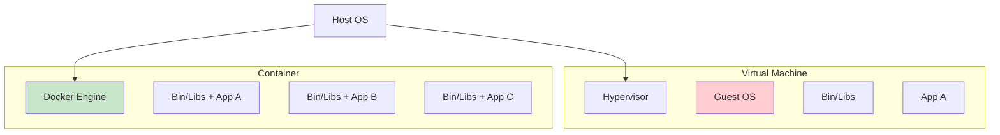
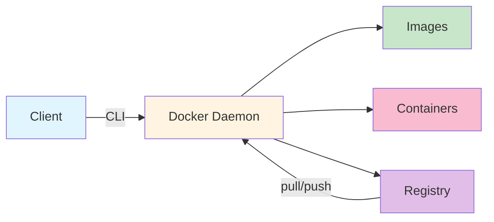

# Chapter 13: Docker Containers

## Learning Objectives

By the end of this chapter, you will be able to:

- [x] Understand what containers are and why they're useful
- [x] Install and configure Docker on Linux
- [x] Run Docker containers from existing images
- [x] Manage container lifecycle (start, stop, remove)
- [x] Build custom Docker images with Dockerfiles
- [x] Use Docker Compose for multi-container applications
- [x] Understand container networking and volumes

## Prerequisites

- Completed Part III: System Administration
- Basic understanding of Linux processes and permissions
- Familiarity with the command line

---

## What Are Containers?

### The Problem Containers Solve

Have you ever heard: *"It works on my machine!"*

This classic developer complaint occurs because:
- Different operating systems (Windows vs. Linux vs. macOS)
- Different library versions
- Different environment configurations
- Missing dependencies

**Containers** solve this by packaging an application with everything it needs to run.

### Containers vs. Virtual Machines



| Aspect | Virtual Machines | Containers |
|--------|------------------|------------|
| **Operating System** | Full guest OS per VM | Share host OS kernel |
| **Startup Time** | Minutes | Seconds/milliseconds |
| **Resource Usage** | GBs of RAM | MBs of RAM |
| **Disk Space** | Multiple GBs | Tens to hundreds of MBs |
| **Isolation** | Complete | Process-level |
| **Portability** | Limited | Highly portable |

### Why Use Containers?

1. **Consistency:** "It works on my machine" becomes "It works everywhere"
2. **Isolation:** Applications don't interfere with each other
3. **Portability:** Run the same container on laptop, server, or cloud
4. **Scalability:** Easily spawn multiple instances
5. **Efficiency:** Lightweight compared to VMs
6. **DevOps:** Bridge development and operations

---

## Installing Docker

### Fedora

Docker is available in Fedora's repositories:

```bash
# Install Docker
sudo dnf install docker

# Start and enable Docker service
sudo systemctl enable --now docker

# Verify installation
docker --version
# Docker version 26.0.0, build ...`

docker run hello-world
```

### Debian

On Debian-based systems:

```bash
# Update package index
sudo apt update

# Install Docker
sudo apt install docker.io

# Start and enable Docker service
sudo systemctl enable --now docker

# Verify installation
docker --version
```

### Managing Docker as a Non-Root User

By default, Docker requires `sudo`. To run Docker without `sudo`:

```bash
# Add your user to the docker group
sudo usermod -aG docker $USER

# Log out and back in for changes to take effect
# Or use:
newgrp docker
```

> **Security Note:** Adding users to the `docker` group gives them root-equivalent privileges. Only do this for trusted users.

### Starting the Docker Service

```bash
# Start Docker
sudo systemctl start docker

# Enable Docker to start on boot
sudo systemctl enable docker

# Check Docker status
sudo systemctl status docker
```

---

## Docker Architecture



- **Docker Client:** Command-line interface (`docker` command)
- **Docker Daemon:** Background service that manages containers
- **Images:** Read-only templates for containers
- **Containers:** Running instances of images
- **Registry:** Repository of images (Docker Hub is the default)

---

## Running Your First Container

### Hello World

The classic first container:

```bash
docker run hello-world
```

Output:
```
Unable to find image 'hello-world:latest' locally
latest: Pulling from library/hello-world
...
Hello from Docker!
This message shows that your installation appears to be working correctly.
```

What happened:
1. Docker checked for the `hello-world` image locally
2. Not found locally, so it pulled from Docker Hub
3. Docker created a container from the image
4. The container ran, printed the message, and exited

### Running an Interactive Container

Run an Ubuntu container with an interactive shell:

```bash
docker run -it ubuntu bash
```

Flags:
- `-i` — Keep STDIN open even if not attached
- `-t` — Allocate a pseudo-TTY

You're now inside a container! Try:
```bash
# Inside the container
ls /
cat /etc/os-release
echo "Hello from container!" > /tmp/test.txt
cat /tmp/test.txt

# Exit the container
exit
```

### Running in Detached Mode

Run containers in the background:

```bash
# Run nginx in the background
docker run -d --name my-webserver nginx
```

Flags:
- `-d` — Detached mode (run in background)
- `--name` — Give the container a name

View running containers:
```bash
docker ps
```

View all containers (including stopped):
```bash
docker ps -a
```

---

## Essential Docker Commands

### Image Management

| Command | Description |
|---------|-------------|
| `docker pull <image>` | Download an image from registry |
| `docker images` | List locally stored images |
| `docker rmi <image>` | Delete an image |
| `docker image prune` | Remove unused images |

### Container Management

| Command | Description |
|---------|-------------|
| `docker run <image>` | Create and start a container |
| `docker ps` | List running containers |
| `docker ps -a` | List all containers |
| `docker stop <container>` | Gracefully stop a container |
| `docker kill <container>` | Forcefully stop a container |
| `docker start <container>` | Start a stopped container |
| `docker restart <container>` | Restart a container |
| `docker rm <container>` | Delete a container |
| `docker container prune` | Remove stopped containers |

### Information and Debugging

| Command | Description |
|---------|-------------|
| `docker logs <container>` | Show container logs |
| `docker inspect <container>` | View container details |
| `docker exec -it <container> <cmd>` | Run command in container |
| `docker stats` | Live resource usage |

---

## Working with Containers

### Example: Web Server

Run an nginx web server:

```bash
# Run nginx in the background
docker run -d --name my-nginx -p 8080:80 nginx
```

Flags:
- `-p 8080:80` — Map host port 8080 to container port 80

Test it:
```bash
curl http://localhost:8080
```

Or open in your browser: `http://localhost:8080`

View logs:
```bash
docker logs my-nginx
```

Stop the container:
```bash
docker stop my-nginx
```

Remove the container:
```bash
docker rm my-nginx
```

### Example: Database

Run a PostgreSQL database:

```bash
# Run PostgreSQL with environment variables
docker run -d \
  --name my-postgres \
  -e POSTGRES_PASSWORD=mysecretpassword \
  -p 5432:5432 \
  postgres
```

Flags:
- `-e` — Set environment variables

Connect to the database:
```bash
docker exec -it my-postgres psql -U postgres
```

---

## Building Custom Images

### What Is a Dockerfile?

A **Dockerfile** is a recipe for building a Docker image. It contains instructions for:

- Base image to use
- Files to copy
- Commands to run
- Ports to expose
- Environment variables

### Creating Your First Dockerfile

Create a simple web application:

```bash
mkdir my-docker-app
cd my-docker-app
```

Create `app.py`:
```python
from flask import Flask
app = Flask(__name__)

@app.route('/')
def hello():
    return """
    <html>
        <head><title>My Docker App</title></head>
        <body>
            <h1>Hello from Docker!</h1>
            <p>This app is running in a container.</p>
        </body>
    </html>
    """

if __name__ == '__main__':
    app.run(host='0.0.0.0', port=5000)
```

Create `requirements.txt`:
```
flask==3.0.0
```

Create `Dockerfile`:
```dockerfile
# Use Python 3.11 as base image
FROM python:3.11-slim

# Set working directory
WORKDIR /app

# Copy requirements and install
COPY requirements.txt .
RUN pip install --no-cache-dir -r requirements.txt

# Copy application code
COPY app.py .

# Expose port
EXPOSE 5000

# Run the application
CMD ["python", "app.py"]
```

### Building the Image

```bash
# Build the image
docker build -t my-python-app .
```

Flags:
- `-t my-python-app` — Tag the image with a name
- `.` — Build context (current directory)

Output:
```
[+] Building 45.2s (10/10) FINISHED
...
=> => naming to docker.io/library/my-python-app
```

### Running Your Custom Image

```bash
# Run the container
docker run -d --name my-app -p 5000:5000 my-python-app
```

Test it:
```bash
curl http://localhost:5000
```

### Dockerfile Instructions Reference

| Instruction | Description | Example |
|-------------|-------------|---------|
| `FROM` | Base image | `FROM ubuntu:22.04` |
| `WORKDIR` | Set working directory | `WORKDIR /app` |
| `COPY` | Copy files from host | `COPY . /app` |
| `ADD` | Copy files (supports URLs/tar) | `ADD app.tar.gz /app` |
| `RUN` | Execute command during build | `RUN apt-get update` |
| `CMD` | Default command to run | `CMD ["nginx"]` |
| `ENTRYPOINT` | Container's main command | `ENTRYPOINT ["python"]` |
| `ENV` | Set environment variable | `ENV APP_ENV=prod` |
| `EXPOSE` | Document exposed port | `EXPOSE 80` |
| `VOLUME` | Create mount point | `VOLUME /data` |

---

## Docker Compose

### What Is Docker Compose?

**Docker Compose** is a tool for defining and running multi-container applications. Instead of running multiple `docker run` commands, you define services in a YAML file.

### Installing Docker Compose

Docker Compose is typically included with Docker. Check:

```bash
docker compose version
# Docker Compose version v2.24.0
```

### Creating a docker-compose.yml

Create a complete web application with a database:

```bash
mkdir my-compose-app
cd my-compose-app
```

Create `docker-compose.yml`:
```yaml
version: '3.8'

services:
  web:
    build: .
    ports:
      - "5000:5000"
    depends_on:
      - db
    environment:
      - DATABASE_URL=postgresql://postgres:password@db:5432/mydb
    volumes:
      - ./app:/app

  db:
    image: postgres:15
    environment:
      - POSTGRES_PASSWORD=password
      - POSTGRES_DB=mydb
    volumes:
      - db-data:/var/lib/postgresql/data

volumes:
  db-data:
```

Create a simple `app/Dockerfile`:
```dockerfile
FROM python:3.11-slim
WORKDIR /app
RUN pip install flask psycopg2-binary
COPY app.py .
CMD ["python", "app.py"]
```

Create `app/app.py`:
```python
from flask import Flask
import os

app = Flask(__name__)

@app.route('/')
def hello():
    db_url = os.getenv('DATABASE_URL', 'not set')
    return f"<h1>Web Server Running</h1><p>DB: {db_url}</p>"

if __name__ == '__main__':
    app.run(host='0.0.0.0', port=5000)
```

### Running Docker Compose

```bash
# Start all services
docker compose up -d

# View running services
docker compose ps

# View logs
docker compose logs

# View logs for a specific service
docker compose logs web

# Stop all services
docker compose down

# Stop and remove volumes
docker compose down -v
```

---

## Container Networking

### Understanding Container Networks

By default, containers are isolated from each other. Docker provides networking options:

| Network Type | Description |
|--------------|-------------|
| **bridge** | Default, containers on same host communicate |
| **host** | Container uses host's network (no isolation) |
| **none** | No networking |
| **overlay** | Multi-host networking (Swarm, Kubernetes) |

### Creating a Network

```bash
# Create a custom network
docker network create my-network

# Run containers on the network
docker run -d --name app1 --network my-network nginx
docker run -d --name app2 --network my-network nginx

# Containers can communicate by name
docker exec app1 curl app2
```

### Listing Networks

```bash
docker network ls
```

---

## Persistent Data with Volumes

### What Are Volumes?

Volumes persist data after containers are removed. Containers are ephemeral—volumes are not.

### Creating and Using Volumes

```bash
# Create a volume
docker volume create my-data

# Use a volume
docker run -d --name my-app -v my-data:/data nginx

# Inspect volume
docker volume inspect my-data

# List volumes
docker volume ls

# Remove volume (when no containers use it)
docker volume rm my-data
```

### Bind Mounts

Mount a host directory into a container:

```bash
# Mount current directory to /app in container
docker run -v $(pwd):/app -w /app python:3.11 python script.py
```

---

## Docker Workflow Diagram


---

## Summary

**Key Takeaways:**

- **Containers** are lightweight, portable application environments
- **Docker** is the leading container platform
- **Images** are read-only templates, **containers** are running instances
- **Dockerfiles** define how to build images
- **Docker Compose** manages multi-container applications
- **Volumes** provide persistent data storage
- **Networks** enable container communication

**Docker Philosophy:**
- One concern per container
- Containers should be ephemeral
- Use volumes for persistent data
- Use compose for multi-container apps

---

## Chapter Quiz

Test your understanding of Docker containers:

{{#quiz ../../quizzes/chapter-13.toml}}

---

## Exercises

### Exercise 1: Run a Web Server

Run an nginx web server:

1. Pull the nginx image
2. Run nginx in detached mode on port 8080
3. Verify it's running with `curl`
4. View the container logs
5. Stop and remove the container

**Expected Output:**
```bash
$ curl http://localhost:8080
<!DOCTYPE html>
<html>
<head>
<title>Welcome to nginx!</title>
...
```

### Exercise 2: Build a Custom Image

Create a simple HTML server:

1. Create a directory with an `index.html` file
2. Write a Dockerfile that uses nginx and copies your HTML
3. Build the image with tag `my-web`
4. Run the container on port 8081
5. Verify your custom page loads

### Exercise 3: Multi-Container App

Use Docker Compose to run a web app with database:

1. Create a `docker-compose.yml` with:
   - A Python/Flask web service
   - A PostgreSQL database
2. Configure networking between services
3. Start with `docker compose up`
4. Verify the services communicate
5. Clean up with `docker compose down`

### Exercise 4: Persistent Data

Practice using volumes:

1. Create a named volume
2. Run a container that writes to the volume
3. Remove the container
4. Run a new container with the same volume
5. Verify the data persists

### Exercise 5: Image Inspection

Explore Docker internals:

1. Pull an image (e.g., `python:3.11`)
2. Use `docker inspect` to view image details
3. Identify the layers, environment variables, and exposed ports
4. Run the container and explore the filesystem
5. Compare two different image tags

---

## Expected Output

After completing these exercises, you should have:

1. **Running containers** — you've started, stopped, and removed containers
2. **Custom images** — you've built images from Dockerfiles
3. **Multi-container apps** — you've used Docker Compose
4. **Persistent data** — you've used volumes for data persistence
5. **Docker knowledge** — you understand images, containers, and the Docker ecosystem

---

## Further Reading

- [Docker Documentation](https://docs.docker.com/)
- [Docker Hub](https://hub.docker.com/) — Find and share images
- [Dockerfile Best Practices](https://docs.docker.com/develop/develop-images/dockerfile_best-practices/)
- [Docker Compose Reference](https://docs.docker.com/compose/compose-file/)

---

## Common Pitfalls

### Don't Run as Root Inside Containers

By default, containers run as root. Use the `USER` instruction:

```dockerfile
RUN adduser -u 5678 --disabled-password --gecos "" appuser
USER appuser
```

### Don't Put Secrets in Images

Use environment variables or secrets management:

```dockerfile
# Don't do this:
# ENV API_KEY=sk-1234567890

# Do this:
ENV API_KEY_FILE=/run/secrets/api_key
```

### Don't Create Large Images

Use multi-stage builds and minimal base images:

```dockerfile
# Build stage
FROM golang:1.21 AS builder
WORKDIR /app
COPY . .
RUN go build -o app

# Runtime stage (much smaller)
FROM alpine:latest
COPY --from=builder /app/app /app
CMD ["/app"]
```

### Don't Forget Resource Limits

Prevent containers from consuming all resources:

```bash
docker run -m 512m --cpus=1.0 nginx
```

---

## Discussion Questions

1. How do containers differ from virtual machines at the kernel level?
2. When would you use a bind mount instead of a volume?
3. Why might you choose Alpine Linux as a base image?
4. How does Docker handle security isolation between containers?
5. What are the trade-offs between using Docker and bare metal deployment?
